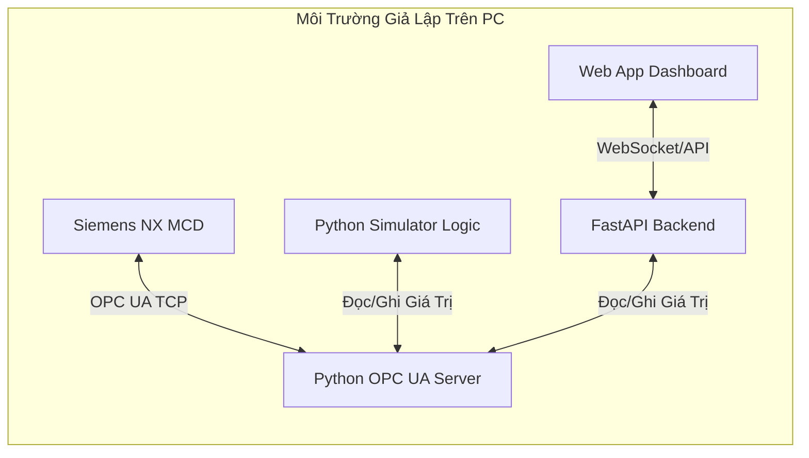

Mô Phỏng Digital Twin Với Siemens NX MCD (Không Cần Phần Cứng)

Hệ thống Digital Twin (DT) cho phép bạn đồng bộ hóa mô hình 3D ảo và hệ thống điều khiển thực tế. Đối với đồ án **Ứng dụng AIoT trồng xà lách thủy canh NFT** của bạn, bạn hoàn toàn có thể chạy thử nghiệm và kiểm tra toàn bộ hoạt động của hệ thống mà **không cần bất kỳ thiết bị phần cứng nào** (ESP32, Raspberry Pi, cảm biến, hay máy bơm vật lý). Phương pháp này gọi là **Software-in-the-Loop (SIL)**.

---

## 1. NX MCD Có Thể Mô Phỏng Được Những Gì?

**Siemens NX MCD (Mechatronics Concept Designer)** là công cụ mô phỏng động học và vật lý mạnh mẽ. Áp dụng vào hệ thống thủy canh NFT của bạn, NX MCD có thể mô phỏng:

### A. Động Học & Vật Lý Cơ Học (Kinematics & Physics)
* **Chuyển động của cánh quạt:** Gắn trục xoay (`Hinged Joint`) cho 4 quạt thông gió. Bạn ánh xạ tín hiệu PWM từ hệ thống (0 - 255) thành tốc độ quay tương ứng (`Speed Control`) trên mô hình 3D.
* **Hoạt động của các máy bơm:** 3 Bơm dinh dưỡng và Bơm chìm 12V được mô phỏng dòng chảy hạt chất lỏng thay đổi liên tục tương ứng độ rộng xung PWM (0-255). Bơm chính 220V AC và bơm sục khí 220V AC được đóng/mở ON/OFF.
* **Mực nước trong bể chứa:** Bạn có thể dựng phao đo mực nước dịch chuyển lên/xuống vật lý bằng khớp tịnh tiến (`Prismatic Joint`) tương ứng với thể tích nước ảo trong bể.
* **Máng NFT & Dòng chảy dung dịch:** MCD hỗ trợ mô phỏng các hạt vật lý (`Water Particles`). Bạn có thể cho nước ảo phun ra từ ống cấp, chảy dọc máng NFT nhờ trọng lực ảo, rơi xuống bể thu hồi.

### B. Cảm Biến & Cơ Cấu Chấp Hành Ảo (Virtual Sensors & Actuators)
* **Cảm biến tiệm cận/mực nước ảo (Y26):** Đặt cảm biến va chạm (`Collision Sensor`) trong lòng bể chứa. Khi mực nước ảo (hoặc phao ảo) dâng chạm cảm biến, nó sẽ phát tín hiệu `True` gửi ngược về hệ thống điều khiển.
* **Hiển thị chỉ số trực tiếp (Dynamic Text Panel):** Gắn các màn hình text hiển thị các chỉ số thời gian thực như Nhiệt độ, Độ ẩm, pH, TDS bay lơ lửng ngay trên giàn trồng 3D để người vận hành dễ quan sát.
* **Đèn LED Grow:** Thay đổi thuộc tính vật liệu của đèn (từ xám tối sang màu hồng/đỏ rực sáng nhờ thuộc tính `Emission/Luminance`) khi nhận tín hiệu Relay `ON` từ điều khiển.

### C. Mô Phỏng Sinh Học & Liên Kết AI (XGBoost Integration)
* **Co giãn hình thể cây theo tiến trình phát triển thực tế:** Đọc giá trị `% Sinh trưởng` (`ai.growth_percent` từ 0% đến 100%) từ mô hình dự báo XGBoost thông qua OPC UA. NX MCD gán biến này vào tham số `Scale Factor` (hệ số tỉ lệ) của cụm mô hình cây xà lách 3D. Cây ảo sẽ tự động lớn lên (phóng to) tương ứng với tốc độ sinh trưởng của cây thật.
* **Đếm ngược ngày thu hoạch:** Trực quan hóa số ngày còn lại (`ai.days_remaining`) dưới dạng nhãn 3D Text lơ lửng trên giàn cây ảo.

---

## 2. Kiến Trúc Giả Lập Không Cần Phần Cứng (SIL)

Thay vì kết nối phần cứng thật, chúng ta dùng máy tính để giả lập toàn bộ tín hiệu. Mô hình dữ liệu sẽ chạy tuần hoàn như sau:



* **Python OPC UA Server:** Đóng vai trò là "cầu nối trung tâm" lưu trữ các tag (nhiệt độ, pH, trạng thái bơm...).
* **Python Simulator Logic:** Chạy ngầm để liên tục tính toán "vật lý ảo" (ví dụ: nếu bật quạt thì nhiệt độ giảm dần, nếu bật bơm dinh dưỡng thì TDS tăng lên, nếu tắt bơm nước thì mực nước máng giảm...).
* **FastAPI Backend & Web App:** Điều khiển thiết bị và hiển thị biểu đồ y hệt như đang chạy với giàn cây thật.
* **NX MCD:** Kết nối vào OPC UA Server nội bộ để lấy dữ liệu vẽ chuyển động 3D và cập nhật trạng thái cảm biến.

---

## 3. Code Mẫu Giả Lập Hệ Thống (Simulator)

Dưới đây là mã nguồn Python hoàn chỉnh sử dụng thư viện `asyncua` (thế hệ mới của `opcua`). Script này sẽ:
1. Tạo một OPC UA Server chạy tại `opc.tcp://127.0.0.1:4840`.
2. Tạo đầy đủ các node (tag) cảm biến và cơ cấu chấp hành đúng như thiết kế của bạn.
3. Chạy vòng lặp giả lập vật lý (phản hồi logic của quạt, bơm, nhiệt độ, pH, TDS) để bạn kiểm tra thuật toán.

### Hướng dẫn chạy thử:
1. Cài đặt thư viện:
   ```bash
   pip install asyncua
   ```
2. Lưu file dưới tên `opcua_simulator.py` và chạy:
   ```bash
   python opcua_simulator.py
   ```
3. Kết nối **NX MCD** hoặc phần mềm test **UaExpert** tới địa chỉ: `opc.tcp://127.0.0.1:4840`.

```python
import asyncio
import logging
import random
from asyncua import Server, ua

# Cấu hình log
logging.basicConfig(level=logging.INFO)
logger = logging.getLogger("OPCUA_Simulator")

async def main():
    # 1. Khởi tạo OPC UA Server
    server = Server()
    await server.init()
    server.set_endpoint("opc.tcp://127.0.0.1:4840")
    server.set_server_name("Hydroponics NFT Digital Twin Server")

    # 2. Đăng ký Namespace
    uri = "http://hydroponics.digitaltwin"
    idx = await server.register_namespace(uri)
    logger.info(f"Namespace registered with Index: {idx}")

    # Lấy node Objects root
    objects = server.nodes.objects

    # 3. Tạo thư mục cấu trúc
    sensors_folder = await objects.add_folder(idx, "Sensors")
    actuators_folder = await objects.add_folder(idx, "Actuators")

    # --- Đăng ký các Node Cảm biến (Sensors) ---
    n_temp = await sensors_folder.add_variable(ua.NodeId("sensor.temp", idx), "Air_Temperature", 27.5)
    n_hum = await sensors_folder.add_variable(ua.NodeId("sensor.humidity", idx), "Air_Humidity", 75.0)
    n_wtemp = await sensors_folder.add_variable(ua.NodeId("sensor.water_temp", idx), "Water_Temperature", 24.5)
    n_tds = await sensors_folder.add_variable(ua.NodeId("sensor.tds", idx), "TDS_Concentration", 650.0)
    n_ph = await sensors_folder.add_variable(ua.NodeId("sensor.ph", idx), "pH_Level", 6.0)
    n_light = await sensors_folder.add_variable(ua.NodeId("sensor.light", idx), "Light_Intensity", 12000.0)
    
    # Mực nước (Y26 PNP x 4)
    n_wlevel1 = await sensors_folder.add_variable(ua.NodeId("sensor.water_level_1", idx), "Water_Level_1", True)
    n_wlevel2 = await sensors_folder.add_variable(ua.NodeId("sensor.water_level_2", idx), "Water_Level_2", True)
    n_wlevel3 = await sensors_folder.add_variable(ua.NodeId("sensor.water_level_3", idx), "Water_Level_3", False)
    n_wlevel4 = await sensors_folder.add_variable(ua.NodeId("sensor.water_level_4", idx), "Water_Level_4", False)

    # Đặt quyền ghi cho biến cảm biến để simulator có thể update
    for node in [n_temp, n_hum, n_wtemp, n_tds, n_ph, n_light, n_wlevel1, n_wlevel2, n_wlevel3, n_wlevel4]:
        await node.set_writable()

    # --- Đăng ký các Node Thiết bị (Actuators) ---
    # Bơm dinh dưỡng (PWM 0-255)
    n_pump_dd1 = await actuators_folder.add_variable(ua.NodeId("actuator.pump_dd_1", idx), "Pump_Nutrient_A", 0.0)
    n_pump_dd2 = await actuators_folder.add_variable(ua.NodeId("actuator.pump_dd_2", idx), "Pump_Nutrient_B", 0.0)
    n_pump_dd3 = await actuators_folder.add_variable(ua.NodeId("actuator.pump_dd_3", idx), "Pump_pH_Down", 0.0)
    n_pump_air = await actuators_folder.add_variable(ua.NodeId("actuator.pump_air", idx), "Pump_Aerator", 0.0)
    
    # Quạt (PWM 0-255)
    n_fan1 = await actuators_folder.add_variable(ua.NodeId("actuator.fan_1", idx), "Fan_1", 0.0)
    n_fan2 = await actuators_folder.add_variable(ua.NodeId("actuator.fan_2", idx), "Fan_2", 0.0)
    n_fan3 = await actuators_folder.add_variable(ua.NodeId("actuator.fan_3", idx), "Fan_3", 0.0)
    n_fan4 = await actuators_folder.add_variable(ua.NodeId("actuator.fan_4", idx), "Fan_4", 0.0)
    
    # Relay ON/OFF
    n_pump_220v = await actuators_folder.add_variable(ua.NodeId("actuator.pump_220v", idx), "Main_Pump_220V", False)
    n_light1 = await actuators_folder.add_variable(ua.NodeId("actuator.light_1", idx), "Grow_Light_1", False)
    n_light2 = await actuators_folder.add_variable(ua.NodeId("actuator.light_2", idx), "Grow_Light_2", False)
    n_light3 = await actuators_folder.add_variable(ua.NodeId("actuator.light_3", idx), "Grow_Light_3", False)
    n_light4 = await actuators_folder.add_variable(ua.NodeId("actuator.light_4", idx), "Grow_Light_4", False)

    # --- Đăng ký các Node AI Dự đoán (AI Predictions) ---
    ai_folder = await objects.add_folder(idx, "AI_Predictions")
    n_growth_percent = await ai_folder.add_variable(ua.NodeId("ai.growth_percent", idx), "Growth_Percent", 15.0)
    n_days_remaining = await ai_folder.add_variable(ua.NodeId("ai.days_remaining", idx), "Days_Remaining", 22.0)

    # Đặt quyền ghi cho actuators và AI để Web App hoặc NX MCD có thể điều khiển trực tiếp
    for node in [n_pump_dd1, n_pump_dd2, n_pump_dd3, n_pump_air, n_fan1, n_fan2, n_fan3, n_fan4, n_pump_220v, n_light1, n_light2, n_light3, n_light4, n_growth_percent, n_days_remaining]:
        await node.set_writable()

    # Khởi động server
    logger.info("Starting OPC UA Server...")
    async with server:
        logger.info("OPC UA Server is running at: opc.tcp://127.0.0.1:4840")
        
        # --- Khởi tạo các giá trị mô phỏng môi trường ảo ---
        sim_temp = 28.0
        sim_ph = 6.2
        sim_tds = 600.0
        sim_water_volume = 40.0  # Lít
        sim_growth_percent = 15.0

        while True:
            # Đọc các giá trị điều khiển từ Client (Web App hoặc MCD vừa ghi vào)
            fan1_val = await n_fan1.get_value()
            fan2_val = await n_fan2.get_value()
            pump_dd1_val = await n_pump_dd1.get_value()
            pump_dd3_val = await n_pump_dd3.get_value()
            pump_220v_val = await n_pump_220v.get_value()
            light1_val = await n_light1.get_value()

            # --- VÒNG LẶP MÔ PHỎNG VẬT LÝ ẢO ---
            # 1. Giả lập Nhiệt độ không khí
            active_fans = (fan1_val + fan2_val) / 510.0
            if active_fans > 0.1:
                sim_temp -= active_fans * 0.15 + random.uniform(-0.02, 0.02)
                sim_temp = max(24.0, sim_temp)
            else:
                sim_temp += 0.05 + random.uniform(-0.02, 0.02)
                sim_temp = min(32.5, sim_temp)

            # 2. Giả lập TDS
            sim_tds -= 0.02
            if pump_dd1_val > 0:
                sim_tds += (pump_dd1_val / 255.0) * 5.0
            sim_tds = max(100.0, min(1200.0, sim_tds))

            # 3. Giả lập pH (Dao động tự nhiên tăng nhẹ, nếu bơm pH Down bật -> pH giảm mạnh)
            sim_ph += 0.002 + random.uniform(-0.004, 0.004) # Xu hướng tăng pH tự nhiên
            if pump_dd3_val > 0:
                sim_ph -= (pump_dd3_val / 255.0) * 0.08  # Bơm pH Down châm acid để hạ pH
            sim_ph = max(4.0, min(8.5, sim_ph))

            # 4. Giả lập Mực nước bể chứa
            if pump_220v_val:
                sim_water_volume -= 0.05
            else:
                sim_water_volume += 0.04
            sim_water_volume = max(10.0, min(60.0, sim_water_volume))

            w1 = sim_water_volume >= 15.0
            w2 = sim_water_volume >= 25.0
            w3 = sim_water_volume >= 35.0
            w4 = sim_water_volume >= 45.0

            # 5. Giả lập cường độ ánh sáng
            sim_light = 500.0
            if light1_val:
                sim_light += 15000.0

            # 6. Giả lập sinh trưởng cây ảo (Tăng 0.05% mỗi giây)
            sim_growth_percent += 0.05
            if sim_growth_percent > 100.0:
                sim_growth_percent = 0.0
            sim_days_remaining = max(0.0, 30.0 * (1.0 - sim_growth_percent / 100.0))

            # --- UPDATE LÊN OPC UA SERVER ---
            await n_temp.write_value(round(sim_temp, 2))
            await n_hum.write_value(round(75.0 + random.uniform(-1.0, 1.0), 1))
            await n_wtemp.write_value(round(sim_temp - 2.5 + random.uniform(-0.1, 0.1), 2))
            await n_tds.write_value(round(sim_tds, 1))
            await n_ph.write_value(round(sim_ph, 2))
            await n_light.write_value(sim_light)
            await n_wlevel1.write_value(w1)
            await n_wlevel2.write_value(w2)
            await n_wlevel3.write_value(w3)
            await n_wlevel4.write_value(w4)
            await n_growth_percent.write_value(round(sim_growth_percent, 2))
            await n_days_remaining.write_value(round(sim_days_remaining, 1))

            logger.info(
                f"[SIM] Temp: {sim_temp:.1f}°C | TDS: {sim_tds:.1f} ppm | pH: {sim_ph:.2f} | "
                f"Vol: {sim_water_volume:.1f}L (Phao: {int(w1)}{int(w2)}{int(w3)}{int(w4)}) | "
                f"Growth: {sim_growth_percent:.2f}% ({sim_days_remaining:.1f} days left) | "
                f"Fan1: {fan1_val} | Pump220V: {pump_220v_val}"
            )

            await asyncio.sleep(1.0)

if __name__ == "__main__":
    asyncio.run(main())
```

---

## 5. Các Bước Thiết Lập Phía Siemens NX MCD

Khi đã có OPC UA Server giả lập ở trên, bạn tiến hành map tín hiệu ảo vào mô hình 3D trong Siemens NX:

1. **Vẽ mô hình 3D (NX CAD):**
   * Vẽ giàn thủy canh, các máng trồng NFT, cánh quạt thông gió, trục động cơ máy bơm và bồn chứa nước.
2. **Khai báo Động học cơ điện tử (NX MCD):**
   * Định nghĩa các phần cứng là `Rigid Body` (Khung giàn, máng...).
   * Định nghĩa cánh quạt là `Rigid Body` và gắn khớp quay `Hinged Joint`. Thêm bộ điều khiển tốc độ `Speed Control` gắn vào khớp này.
   * Tạo các biến logic nội bộ trong MCD (`Signal`) tương ứng với tốc độ quạt (ví dụ: `mcd_fan_speed`).
3. **Cấu hình Kết nối OPC UA (External Connection):**
   * Trong thanh công cụ MCD, chọn **External Signal Configuration**.
   * Nhấp chọn thêm kết nối kiểu **OPC UA**.
   * Nhập Endpoint URL: `opc.tcp://127.0.0.1:4840`.
   * NX MCD sẽ tự động load toàn bộ cấu trúc tag từ Server lên (bao gồm thư mục `Sensors` và `Actuators`).
4. **Ánh xạ Tín hiệu (Signal Mapping):**
   * Kéo tag `ns=2;s=actuator.fan_1` từ OPC UA map vào tín hiệu điều khiển tốc độ của quạt ảo trong MCD.
   * Kéo các tag cảm biến như `ns=2;s=sensor.temp` map vào các text box hiển thị số liệu 3D.
5. **Chạy mô phỏng (Play):**
   * Bấm nút **Play** trên NX MCD.
   * Chạy song song Web App và Script giả lập Python.
   * Khi bạn nhấn bật quạt trên giao diện Web App ➔ FastAPI truyền lệnh ghi vào OPC UA ➔ Script giả lập ghi nhận ➔ Cánh quạt ảo trong NX MCD bắt đầu xoay tít trên màn hình 3D thời gian thực!
