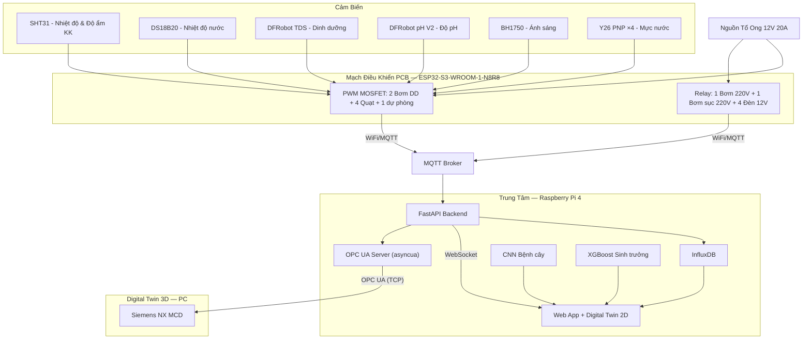

# Kế Hoạch Đồ Án: Ứng Dụng AIOT Trồng Xà Lách Thủy Canh NFT

## Tổng Quan Hệ Thống



---

## PHẦN 1: CƠ KHÍ & NGOẠI VI

### 1.1 Khung & Máng Trồng

| Hạng mục | Thông số | Ghi chú |
|---|---|---|
| Khung | Sắt V lỗ 30x30mm, cao ~1.5m | 2 tầng, mỗi tầng 3 máng |
| Máng NFT | PVC vuông 60x40mm, dài 1m | 6 máng, lỗ Ø50mm cách 15cm |
| Rọ trồng | Rọ nhựa Ø50mm | ~36 cây |
| Bể chứa | Thùng nhựa 50-80L | Chứa dung dịch |
| Độ dốc | 1-2% | Nước chảy về bể |

### 1.2 Thiết Bị Ngoại Vi (CẬP NHẬT MỚI NHẤT)

| # | Thiết bị | Điện áp | SL | Vị trí | Điều khiển | Mục đích |
|---|---|---|---|---|---|---|
| 1 | **Bơm DD chai A** (peristaltic) | 12V DC | 1 | Bể chứa | PWM MOSFET (GPIO 38) | Bơm dung dịch A vào bể |
| 2 | **Bơm DD chai B** (peristaltic) | 12V DC | 1 | Bể chứa | PWM MOSFET (GPIO 39) | Bơm dung dịch B vào bể |
| 3 | **Bơm DD pH Down** (peristaltic) | 12V DC | 1 | Bể chứa | PWM MOSFET (GPIO 1) | Châm dung dịch pH Down giảm pH |
| 4 | **Bơm chìm 12V** (tuần hoàn phụ) | 12V DC | 1 | Bể chứa | PWM MOSFET (GPIO 3) | Đẩy nước lên máng NFT tầng 1-2 |
| 5-8 | **Quạt thông gió** | 12V DC | 4 | Tầng 1 & 2 | PWM MOSFET (GPIO 40,41,42,2) | Giảm nhiệt/độ ẩm, lưu thông khí |
| 9 | **Bơm chính 220V** | 220V AC | 1 | Bể chứa | Relay 1 (GPIO 4) | Bơm cấp nước chính tuần hoàn lớn |
| 10 | **Sục khí 220V** | 220V AC | 1 | Bể chứa | Relay 2 (GPIO 5) | Sục khí oxy trong bể chứa dinh dưỡng |
| 11-14 | **Đèn LED Grow** | 12V DC | 4 | Tầng 1 & 2 | Relay 3-6 (GPIO 6,7,15,16) | Bổ sung quang phổ hỗ trợ xà lách |
| 15 | **Chụp ảnh AI** | Camera ĐT | 1 | — | Thủ công | Chụp ảnh lá bệnh gửi lên FastAPI CNN |

### 1.3 Dung Dịch & Quy Trình

> [!NOTE]
> **Trồng xà lách thủy canh NFT chỉ cần 2 chai dung dịch A-B là đủ.**
> - Xà lách là cây ăn lá, không cần giai đoạn ra hoa/quả → chỉ cần DD A (đa lượng N-P-K) + DD B (trung vi lượng Ca-Mg-Fe).
> - Đồ án cũ dùng 3 chai vì có thêm chai pH Down (acid) để chỉnh pH. Tuy nhiên nếu nước nguồn có pH ổn định (6.5-7.5), pha đúng tỷ lệ AB sẽ tự kéo pH xuống 5.5-6.5.
> - **Khuyến nghị:** Dùng 2 bơm peristaltic cho chai A và B. Nếu sau này pH hay bị trôi cao (>6.5), có thể bổ sung thêm 1 bơm pH Down (kênh PWM dự phòng đã có trên PCB).

- DD thủy canh A-B (2 chai), TDS mục tiêu 500-800 ppm, pH 5.5-6.5
- Tỷ lệ pha: ~2-5 ml DD A + 2-5 ml DD B / 1 lít nước (theo hướng dẫn nhà sản xuất)
- Ươm hạt 5-7 ngày → Chuyển rọ → Thu hoạch sau 25-35 ngày

---

## PHẦN 2: ĐIỆN TỬ & THIẾT KẾ PCB

> [!IMPORTANT]
> **Thay đổi lớn (CẬP NHẬT 2026-06-10):**
> - **ESP32-S3-WROOM-1-N8R8 module** (không dùng DevKit) → nạp code qua **UART header** (không cần CH340C/USB-C), tránh GPIO 26-37 (reserved Octal PSRAM/Flash)
> - **Nguồn: LM2596 hạ 12V→5V** (thay MP1584EN) + AMS1117 5V→3.3V
> - **2 chai dung dịch A-B** (thay 3 chai cũ) → chỉ cần 2 bơm peristaltic, kênh PWM dự phòng cho pH Down
> - **PWM + IRLZ44N MOSFET** cho 2 bơm DD + 1 bơm sục + 4 quạt (7 kênh + 1 dự phòng)
> - **Relay 12V** cho 4 đèn + 1 bơm 220V (5 kênh)
> - **4× Y26 PNP** không tiếp xúc đo mực nước
> - **Module ngoài chỉ gồm:** Module pH PH0-14 + Module TDS (tích hợp DS18B20) → cắm qua Header
> - **KHÔNG dùng module nào khác** — toàn bộ mạch nguồn, MOSFET, Relay thiết kế trực tiếp trên PCB
> - Cảm biến → **header cắm** | Ngoại vi → **terminal đấu dây**

### 2.1 Danh Sách Cảm Biến (Header ra ngoài)

| # | Cảm biến | Model | Giao tiếp | Header PCB | Ghi chú |
|---|---|---|---|---|---|
| 1 | Nhiệt độ + Độ ẩm KK | SHT31 | I2C | 4P (VCC,GND,SDA,SCL) | |
| 2 | Nhiệt độ nước | DS18B20 (tích hợp trong module TDS) | OneWire | Chung connector TDS | Không cần mua rời |
| 3 | TDS | Module TDS Analog (có DS18B20) | Analog + OneWire | 3P TDS + 3P DS18B20 | Module mua sẵn, cắm header |
| 4 | pH | Module pH0-14 Analog (Đức Huy) | Analog | 3P (5V,GND,SIG) | Module mua sẵn, cắm header |
| 5 | Ánh sáng | BH1750 | I2C | Chung header I2C | |
| 6 | Mực nước ×4 | Y26 PNP | Digital | 3P ×4 (VCC,GND,OUT) | |

### 2.2 Ngoại Vi & Phương Pháp Điều Khiển (Terminal ra ngoài)

| # | Ngoại vi | Dòng max | Điều khiển | IC Driver | Terminal |
|---|---|---|---|---|---|
| 1 | Bơm DD chai A 12V | ~2A | PWM MOSFET | IRLZ44N | 2P |
| 2 | Bơm DD chai B 12V | ~2A | PWM MOSFET | IRLZ44N | 2P |
| 3 | Bơm sục khí 12V | ~2A | PWM MOSFET | IRLZ44N | 2P |
| 4-5 | Quạt tầng 1 ×2 | ~0.5A | PWM MOSFET | IRLZ44N ×2 | 2P ×2 |
| 6-7 | Quạt tầng 2 ×2 | ~0.5A | PWM MOSFET | IRLZ44N ×2 | 2P ×2 |
| 8 | (Dự phòng / bơm pH Down) | ~2A | PWM MOSFET | IRLZ44N | 2P |
| 9 | Bơm 220V | 10A | Relay | SRD-12VDC | 3P (COM/NO/NC) |
| 10-11 | Đèn tầng 1 ×2 | ~3A | Relay | SRD-12VDC ×2 | 2P ×2 |
| 12-13 | Đèn tầng 2 ×2 | ~3A | Relay | SRD-12VDC ×2 | 2P ×2 |

### 2.3 GPIO ESP32-S3-WROOM-N8R8

> **Luu y:** GPIO 26-37 bi reserve cho Octal PSRAM/Flash -> KHONG dung!
> Dung ADC1 (GPIO 1-10) cho pH va TDS (khong bi anh huong khi bat WiFi).

```
========================================================================
 CHUC NANG              | GPIO  | CHAN MODULE   | HUONG DI DAY / PHAN VUNG
========================================================================
 -- CAM BIEN (SENSORS) -------------------------------------------------
  pH Analog (ADC1)      |   9   | Pin 17 (Phai) | Di thang sang phai, len goc cam bien
  TDS Analog (ADC1)     |  10   | Pin 18 (Phai) | Di thang sang phai, len goc cam bien
  I2C SDA (SHT31/BH1750)|  17   | Pin 10 (Phai) | Di thang sang phai (I2C Bus)
  I2C SCL               |  18   | Pin 11 (Phai) | Di thang sang phai (I2C Bus)
  DS18B20 Temp (TDS)    |   8   | Pin 12 (Phai) | Di thang sang phai
  Y26 Muc nuoc 1 (PNP)  |  13   | Pin 21 (Tren) | Di thang len tren ra Terminal Y26
  Y26 Muc nuoc 2 (PNP)  |  14   | Pin 22 (Tren) | Di thang len tren ra Terminal Y26
  Y26 Muc nuoc 3 (PNP)  |  21   | Pin 23 (Tren) | Di thang len tren ra Terminal Y26
  Y26 Muc nuoc 4 (PNP)  |  47   | Pin 24 (Tren) | Di thang len tren ra Terminal Y26
 -- PWM MOSFET (PUMP/FAN) ----------------------------------------------
  Bom dinh duong chai A  |  38   | Pin 31 (Trai) | Di thang len phia tren toi MOSFETs
  Bom dinh duong chai B  |  39   | Pin 32 (Trai) | Di thang len phia tren toi MOSFETs
  Bom dinh duong pH Down |   1   | Pin 39 (Trai) | Di thang len phia tren toi MOSFETs
  Bom chim 12V (PWM)     |   3   | Pin 30 (Trai) | Di thang len phia tren toi MOSFETs
  Quat Tang 1 - Trai     |  40   | Pin 33 (Trai) | Di thang len phia tren toi MOSFETs
  Quat Tang 1 - Phai     |  41   | Pin 34 (Trai) | Di thang len phia tren toi MOSFETs
  Quat Tang 2 - Trai     |  42   | Pin 35 (Trai) | Di thang len phia tren toi MOSFETs
  Quat Tang 2 - Phai     |   2   | Pin 38 (Trai) | Di thang len phia tren toi MOSFETs
 -- RELAYS (ULN2803) ---------------------------------------------------
  RL1: Bom chinh 220V AC |   4   | Pin 4 (Phai)  | Di ngang song song vao ULN (I1)
  RL2: Bom suc khi 220V  |   5   | Pin 5 (Phai)  | Di ngang song song vao ULN (I2)
  RL3: Den T1 - Trai    |   6   | Pin 6 (Phai)  | Di ngang song song vao ULN (I3)
  RL4: Den T1 - Phai    |   7   | Pin 7 (Phai)  | Di ngang song song vao ULN (I4)
  RL5: Den T2 - Trai    |  15   | Pin 8 (Phai)  | Di ngang song song vao ULN (I5)
  RL6: Den T2 - Phai    |  16   | Pin 9 (Phai)  | Di ngang song song vao ULN (I6)
 -- HE THONG (SYSTEM) --------------------------------------------------
  UART TX (Nap code)     |  43   | Pin 37 (Trai) | Noi thang sang trai ra UART Header
  UART RX (Nap code)     |  44   | Pin 36 (Trai) | Noi thang sang trai ra UART Header
  Buzzer                 |  48   | Pin 25 (Tren) | Di sang vung Buzzer
  Nut BOOT               |   0   | Pin 27 (Trai) | Nut nhan Boot (Goc tren trai)
========================================================================
  *CHU THICH CUA MODULE XOAY 180 DO:*
  - Canh Duoi: Phan Ang-ten (South) - Khong co chan
  - Canh Tren (North): Gom cac chan 21-26
  - Canh Trai (West): Gom cac chan 27-40 (gan ria trai PCB)
  - Canh Phai (East): Gom cac chan 1-20 (quay vao trong tam PCB)

  *GPIO BI CAM/PSRAM:* GPIO 35, 36, 37 (Tuyet doi khong dung cho ESP32-S3-WROOM-1-N8R8)
  *GPIO BI CAM KHAC:* GPIO 19, 20 (USB D-/D+), GPIO 3 (JTAG), GPIO 45, 46 (Strapping pins)
```

### 2.4 Thiết Kế Các Khối Trên PCB

#### KHỐI 1: NGUỒN (12V → 5V → 3.3V) — ĐÃ THIẾT KẾ XONG (LM2596)
```
Tổ ong 12V 20A → Terminal 2P → Fuse 20A → SS54 (chống ngược) → +12V Rail
                                                                  ↓
+12V → LM2596 (TO-263) + L 33µH + SS34 + R_FB → +5V (3A)  ✅ ĐÃ XONG
+5V  → AMS1117-3.3 (SOT-223)                   → +3.3V (800mA)  ✅ ĐÃ XONG

Phân phối: 12V→MOSFET,Relay,Y26 | 5V→Relay logic,Buzzer,Analog | 3.3V→ESP32,I2C
TVS SMBJ15A song song đầu vào 12V, bypass 0.1µF khắp nơi
```

#### KHỐI 2: MCU + UART NẠP CODE — ĐÃ THIẾT KẾ XONG
```
ESP32-S3-WROOM-1-N8R8 (Hàn chân SMD trực tiếp lên PCB):  ✅ ĐÃ XONG
  3V3 ← AMS1117-3.3 | EN (CHIP_PU) ← R10k→3V3 + C1µF→GND + SW_RST
  IO0 ← R10k→3V3 + SW_BOOT
  GPIO45 (Strapping VDD_SPI) ← để trống hoặc Pull-down

Nạp code qua UART (KHÔNG dùng CH340C/USB-C):  ✅ ĐÃ XONG
  Header 4P: 3.3V, GND, TX(GPIO43), RX(GPIO44)
  Dùng USB-to-UART ngoài (CP2102/CH340) cắm vào header để nạp
  Nhấn BOOT → nhấn RST → thả RST → nạp code → thả BOOT
```

#### KHỐI 3: PWM MOSFET (8 kênh — 3 bơm DD + 1 bơm chìm 12V + 4 quạt)
```
IRLZ44N (TO-220, logic-level, Vgs(th)=1-2V, Id=47A):
  ESP32 GPIO → R100Ω → Gate | R10kΩ pull-down Gate→GND
  +12V → Tải (motor) → Drain | Source → GND
  1N5819 flyback: Cathode→+12V, Anode→Drain

⚡ 3.3V từ ESP32 ĐỦ mở IRLZ44N hoàn toàn
⚡ R10kΩ pull-down giữ OFF khi ESP32 chưa boot
⚡ 1N5819 Schottky hấp thụ back-EMF từ motor
Terminal 2P mỗi kênh: (+12V, DRAIN) → đấu dây motor/quạt
```

#### KHỐI 4: RELAY (6 kênh — đèn + bơm 220V + sục 220V)
```
SRD-12VDC-SL-C (coil 12V, contact 10A/250VAC):
  ESP32 GPIO → R1kΩ → PC817 LED → [CÁCH LY QUANG]
  → PC817 Photo Emitter → Base of S8050
  → S8050 C → Relay Coil(-), Coil(+) → +12V
  1N4148 flyback qua coil | LED báo trạng thái

Bơm 220V & Sục 220V: Terminal 3P (COM/NO/NC) — cách ly PCB ≥3mm
Đèn 12V:  Terminal 2P ×4
PC817 (DIP-4) ×6 gói
```

#### KHỐI 5: CẢM BIẾN (Header)
```
I2C 4P:     3.3V, GND, SDA(17), SCL(18) + pull-up 4.7k×2
OneWire 3P: 3.3V, GND, DATA(8) + pull-up 4.7k + C0.1µF
TDS 3P:     Cắm Header 3P của Module TDS (VCC=5V, GND, SIG) → Phân áp giảm áp R10k/R15k → LPF (R1k+C100nF) → GPIO 10 (ADC1_CH9).
pH 3P:      Cắm Header 3P của Module pH (VCC=5V, GND, SIG) → Phân áp giảm áp R10k/R15k → LPF (R1k+C100nF) → GPIO 9 (ADC1_CH8).
Y26 3P ×4:  12V, GND, OUT → Cầu phân áp giảm từ 12V xuống 3.3V (R10k và R3.3k) → GPIO 13, 14, 21, 47.

*Lưu ý:* Do sử dụng module pH và TDS mua sẵn (đã tích hợp op-amp khuếch đại sẵn trên board rời), ta KHÔNG cần thiết kế mạch LM358 khuếch đại tín hiệu analog trên PCB chính nữa mà chỉ cần thiết kế cầu phân áp bảo vệ ADC và mạch lọc nhiễu thông thấp (LPF) RC.
```

### 2.5 Layout PCB

```
Kích thước: ~180×120mm, 2 lớp

┌─────────────────────────────────────────────────────────┐
│  Terminal 12V IN   [LM2596]   [AMS1117]                 │
│  [FUSE][SS54][TVS]                                      │
│                    ╔═══════════════╗  [Sensor Headers]  │
│  [UART Header]     ║ ESP32-S3-W1 ║  I2C│1W│pH│TDS│Y26 │
│  [RST][BOOT]       ║ anten→rìa   ║  [Header][Buzzer]  │
│                    ╚═══════════════╝                    │
│──────────────── cách ly ────────────────────────────────│
│  [IRLZ44N ×8 TO-220]          [PC817 ×6][S8050×6]      │
│  [1N5819 ×8]                   [Relay ×6]               │
│  ┌─Terminal PWM ×8──┐  ┌──Terminal Relay ×6──┐          │
│  │BơmDD×3│B.Chìm│Quạt×4│  │Bơm220V│Sục220V│Đèn×4│          │
│  └──────────────────┘  └─────────────────────┘          │
│                    ║═ rãnh cách ly 220V ═║              │
└─────────────────────────────────────────────────────────┘

⚡ Anten ESP32 hướng rìa, không GND plane bên dưới
⚡ MOSFET TO-220 cần khoảng trống tản nhiệt
⚡ Vùng 220V cách ly bằng rãnh PCB ≥ 3mm
⚡ GND plane lớp dưới, đường 12V ≥ 2mm
```

### 2.6 BOM Ước Tính

| Hạng mục | Giá (VNĐ) |
|---|---|
| ESP32-S3-WROOM-1-N8R8 + UART header + MCU components | ~120k |
| LM2596 + AMS1117 + power components | ~50k |
| IRLZ44N ×8 + 1N5819 ×8 + R (PWM blocks) | ~65k |
| PC817 ×6 + S8050 ×6 + Relay ×6 + 1N4148 (relay block) | ~100k |
| R, C divider & RC filter for pH & TDS inputs | ~5k |
| Header sensor, terminal, nút, LED, buzzer, PCB | ~160k |
| **Tổng linh kiện PCB** | **~490k** |
| Cảm biến (SHT31+TDS_w_DS18B20+pH+BH1750+Y26×4) | ~975k |
| **TỔNG CỘNG (PCB + Cảm biến)** | **~1.465k** |

### 2.7 Lộ Trình Thiết Kế PCB

```
GĐ 1: CHUẨN BỊ & SCHEMATIC (1-2 tuần)
├── 1.1 Mua linh kiện chính, test trên breadboard
├── 1.2 Vẽ schematic EasyEDA theo 5 khối:
│   ① Nguồn → ② MCU+USB → ③ Sensor header
│   → ④ PWM MOSFET → ⑤ Relay → ⑥ Buzzer/LED
└── 1.3 Chạy ERC, review net label + footprint

GĐ 2: LAYOUT PCB (1 tuần)
├── 2.1 Đặt linh kiện theo phân vùng
├── 2.2 Routing: 12V≥2mm, signal 0.3mm, GND plane
├── 2.3 Rãnh cách ly 220V, DRC check
└── 2.4 Xuất Gerber → đặt JLCPCB

GĐ 3: HÀN & TEST (1-2 tuần)
├── 3.1 Hàn SMD (MP1584, AMS1117, CH340C)
├── 3.2 Test nguồn: 12V→5V→3.3V OK?
├── 3.3 Hàn THT (ESP32 header, MOSFET, Relay, terminal)
├── 3.4 Nạp code blink → test PWM → test relay
└── 3.5 Cắm sensor, calibrate pH/TDS

GĐ 4: TÍCH HỢP (1 tuần)
├── 4.1 Đấu nối toàn bộ cảm biến + ngoại vi
├── 4.2 Test logic: TDS thấp→bơm DD | pH lệch→bơm pH
│   Nhiệt cao→quạt tăng | Tối→đèn bật | Mực nước→bơm 220V
└── 4.3 Kết nối MQTT → Raspberry Pi
```

### 2.8 Giao Tiếp ESP32 ↔ Raspberry Pi (MQTT)

| Topic | Hướng | Mô tả |
|---|---|---|
| `hydro/sensor/data` | ESP32 → Pi | JSON sensor data mỗi 30s |
| `hydro/sensor/status` | ESP32 → Pi | Trạng thái online/offline |
| `hydro/control/pwm` | Pi → ESP32 | Điều khiển PWM (duty cycle) |
| `hydro/control/relay` | Pi → ESP32 | Bật/tắt relay |
| `hydro/control/config` | Pi → ESP32 | Cập nhật ngưỡng tự động |

---

## PHẦN 3: PHẦN MỀM

### 3.1 ESP32 Firmware (Arduino)

**Chức năng chính:**
1. Đọc sensor mỗi 30s → publish JSON MQTT
2. Subscribe lệnh PWM + relay từ Pi
3. **Logic tự động (failsafe khi mất MQTT):**
   - TDS < ngưỡng → bơm DD (PWM điều chỉnh lưu lượng)
   - pH lệch → bơm pH correction
   - Nhiệt độ > ngưỡng → quạt PWM tăng
   - Ánh sáng < ngưỡng → relay đèn ON
   - Mực nước thấp → bơm 220V ON

```json
{
  "temp": 28.5, "humidity": 75.2, "water_temp": 24.1,
  "tds": 650, "ph": 6.1, "light": 15000,
  "water_levels": [1, 1, 0, 1],
  "pwm_duties": [128, 0, 0, 64, 200, 200, 200, 200],
  "relay_states": [0, 1, 1, 1, 1]
}
```

### 3.2 Backend — FastAPI trên Pi 4

| Method | Endpoint | Mô tả |
|---|---|---|
| GET | `/api/sensor-data/latest` | Dữ liệu mới nhất |
| GET | `/api/sensor-data/history?hours=24` | Lịch sử |
| POST | `/api/control/pwm` | Điều khiển PWM duty |
| POST | `/api/control/relay` | Bật/tắt relay |
| POST | `/api/ai/disease-detect` | Upload ảnh → CNN |
| GET | `/api/ai/growth-predict` | Dự đoán sinh trưởng |

### 3.3 Frontend — Web App

- Dashboard realtime (Chart.js + WebSocket)
- Digital Twin 2D (Canvas/SVG) — mô hình tương tác trên Web
- Điều khiển PWM slider + relay toggle
- **Chẩn đoán AI thủ công:** Tích hợp tính năng mở camera điện thoại trực tiếp (HTML5 input capture) để chụp cận cảnh từng lá cây nghi ngờ nhiễm bệnh và upload phân tích lập tức.
- *(Xem thêm mục 3.5: Digital Twin 3D trên NX MCD)*

### 3.4 AI Modules

- **CNN MobileNetV2** (TFLite): Nhận diện bệnh lá từ ảnh chụp cận cảnh bằng điện thoại của người dùng (tải lên qua Web App).
- **XGBoost**: Dự đoán ngày thu hoạch từ sensor data

### 3.5 Digital Twin 3D — Siemens NX MCD

#### Mô hình 3D (NX CAD)
- Vẽ lại 1:1 toàn bộ hệ thống: khung sắt V 2 tầng, 6 máng PVC, bể chứa, hệ thống ống nước
- Đặt chính xác vị trí cảm biến và thiết bị chấp hành trên mô hình

#### Mô phỏng Cơ điện tử (NX MCD)
- Gắn Signal Adapter cho từng thiết bị:
  - Bơm: PWM duty → quay nhanh/chậm
  - Quạt: PWM duty → cánh quạt quay theo tốc độ
  - Đèn: ON/OFF → sáng/tắt
  - Mực nước: Y26 digital → 4 mức hiển thị
  - Sensor: hiển thị giá trị realtime trên mô hình 3D

#### Kết nối OPC UA (Giao tiếp phần mềm & phần cứng linh hoạt)

**1. Giai đoạn Test Mô phỏng (Offline - Chạy trên PC):**
```
[Script test_fans.py] ──► [OPC UA Server Giả Lập (opcua_simulator.py) trên PC] ──► [NX MCD (OPC UA Client)]
```
*Mục đích:* Kiểm tra chuyển động cơ khí cơ điện tử của mô hình 3D trên NX trước khi kết nối phần cứng thực tế.

**2. Giai đoạn Triển khai thật (Live Commissioning - Kết nối Pi & ESP32):**
```
[Cảm biến & Cơ cấu thực] ◄─► [ESP32-S3] ◄─► [Pi 4 (MQTT Broker ◄─► OPC UA Server thật)] ◄─► [NX MCD trên PC]
```
*Mục đích:* Đồng bộ trạng thái thực tế ngoài đời của giàn cây thủy canh lên mô hình 3D trên PC thời gian thực.

| Thành phần | Chi tiết |
|---|---|
| **Pi / VM (Server)** | Python `asyncua` chạy service thật tại `opc.tcp://[IP_cua_Pi_hoac_VM]:4840` |
| **NX MCD (Client)** | Thiết lập External Signal Connection kết nối trực tiếp đến IP của Pi/VM |
| **Signal Mapping** | Ánh xạ (Map) các node tín hiệu OPC UA vào các Joint/Speed Control trên mô hình 3D |
| **Dữ liệu truyền nhận** | Cập nhật trực tiếp Sensor values + PWM duties + Relay states thực tế của ESP32 |

**OPC UA Nodes:**

| Node ID | Kiểu | Mô tả |
|---|---|---|
| `ns=2;s=sensor.temp` | Float | Nhiệt độ KK |
| `ns=2;s=sensor.humidity` | Float | Độ ẩm KK |
| `ns=2;s=sensor.water_temp` | Float | Nhiệt độ nước |
| `ns=2;s=sensor.tds` | Float | TDS (ppm) |
| `ns=2;s=sensor.ph` | Float | pH |
| `ns=2;s=sensor.light` | Float | Ánh sáng (lux) |
| `ns=2;s=sensor.water_level_1..4` | Boolean | Mực nước ×4 |
| `ns=2;s=actuator.pump_dd_1..3` | Int (0-255) | PWM bơm DD |
| `ns=2;s=actuator.pump_air` | Int (0-255) | PWM bơm sục |
| `ns=2;s=actuator.fan_1..4` | Int (0-255) | PWM quạt |
| `ns=2;s=actuator.pump_220v` | Boolean | Relay bơm 220V |
| `ns=2;s=actuator.light_1..4` | Boolean | Relay đèn |

#### Phần mềm cần cài

| Phần mềm | Mục đích | Chi phí |
|---|---|---|
| Siemens NX (Student Edition) | Vẽ mô hình 3D CAD | Miễn phí (SV) |
| NX MCD (module) | Mô phỏng cơ điện tử | Cần kiểm tra license |
| Python `asyncua` | OPC UA Server trên Pi | Miễn phí (pip install) |
| UaExpert | Test/debug OPC UA | Miễn phí |

---

## PHẦN 4: TỰ KHỞI ĐỘNG

- **Pi 4**: systemd service cho Mosquitto + InfluxDB + FastAPI
- **ESP32**: Auto-reconnect WiFi/MQTT, failsafe mode khi offline
- **UPS 12V**: Giữ hệ thống 10-15 phút khi mất điện

---

## PHẦN 5: TIMELINE (14-16 tuần)

| Tuần | Công việc | Output |
|---|---|---|
| 1-2 | Mua linh kiện, dựng khung, test breadboard | Hệ thống cơ khí + test OK |
| 3-4 | Thiết kế schematic + layout PCB (EasyEDA) | File Gerber → đặt JLCPCB |
| 5 | Code ESP32 firmware, test MQTT | Firmware ổn định |
| 6 | Setup Pi: Mosquitto + InfluxDB + FastAPI | Backend hoạt động |
| 7-8 | Web App (Dashboard + Digital Twin) | Giao diện web |
| 9 | Train CNN Colab + deploy Pi | AI bệnh cây |
| 10 | Train XGBoost + tích hợp | AI sinh trưởng |
| 11 | Hàn PCB, lắp ráp, ươm cây | Hệ thống chạy thật |
| 12-14 | Test, calibrate, fix bug | Ổn định |
| 15-16 | Viết báo cáo, bảo vệ | Hoàn thành |

---

## PHẦN 6: KINH PHÍ (~10 triệu VNĐ)

| Hạng mục | Giá (VNĐ) |
|---|---|
| PCB + linh kiện on-board | 530k |
| Cảm biến (module) | 975k |
| Ngoại vi (bơm×5, quạt×4, đèn×4) | 2.000k |
| Cơ khí (khung, máng, bể) | 1.300k |
| Raspberry Pi 4 | ĐÃ CÓ | Tận dụng sẵn, không cần camera gắn giàn |
| Vật tư tiêu hao + dự phòng | 800k |
| **TỔNG** | **~5.605k** (Tiết kiệm 350k nhờ chụp thủ công) |
| Dư ~4tr | Dự phòng, linh kiện thay thế |

---

## Verification Plan

- **Nguồn PCB**: Đo multimeter 12V→5V→3.3V
- **MCU**: Nạp code blink qua USB-C
- **PWM**: Oscilloscope đo duty cycle, motor chạy mượt
- **Relay**: Nghe click, đo tiếp điểm bằng multimeter
- **Sensor**: Serial monitor so sánh với dụng cụ chuẩn
- **MQTT**: MQTT Explorer kiểm tra publish/subscribe
- **WebSocket**: Console browser kiểm tra realtime
- **Auto-restart**: Rút điện → cắm lại → tự khởi động
