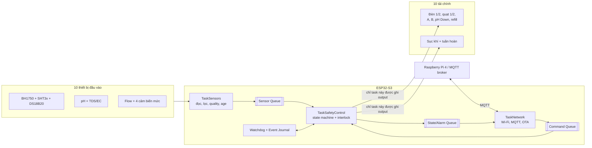
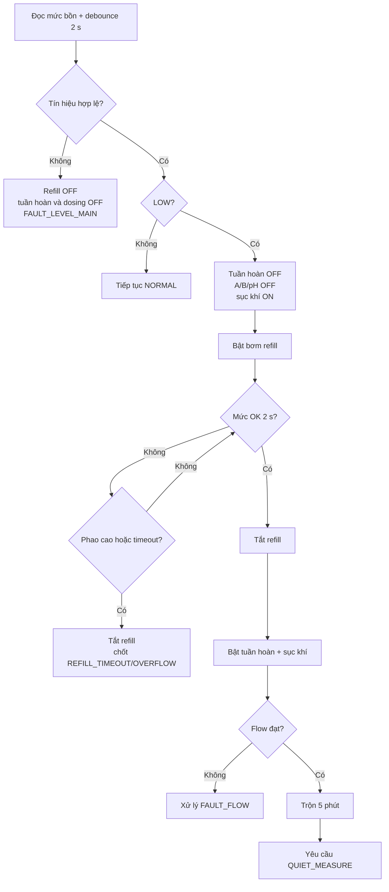
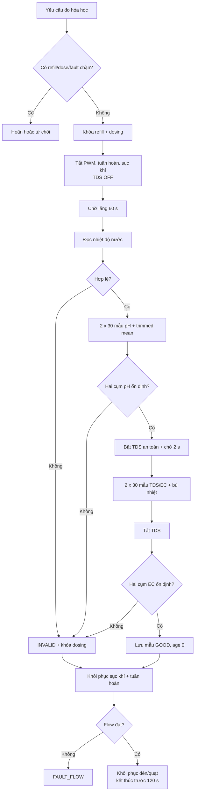
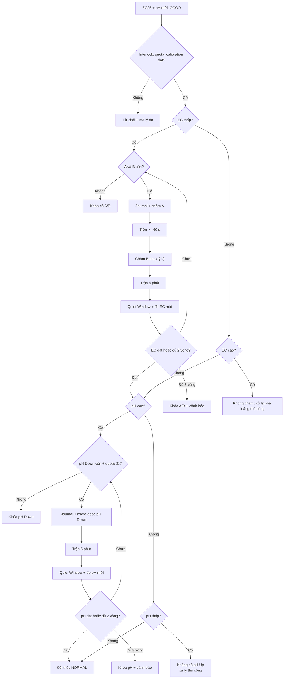
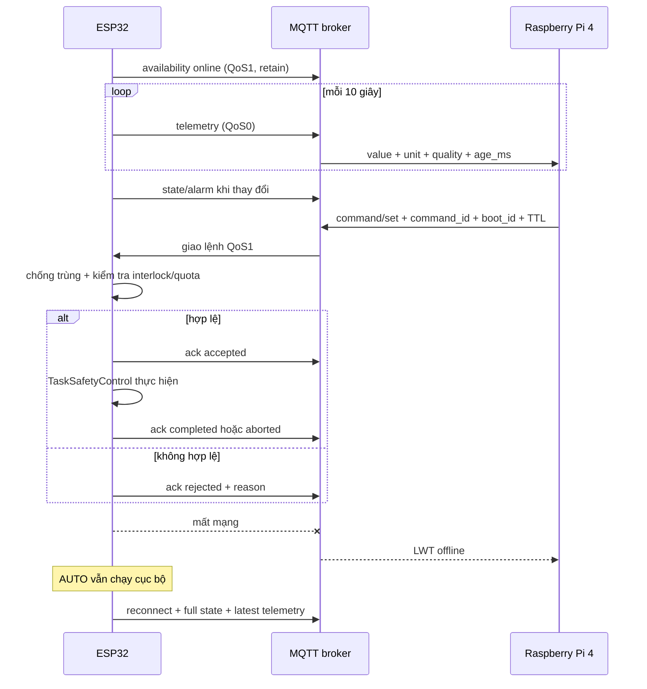
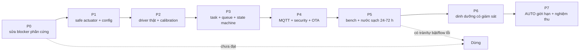

# KỊCH BẢN HOÀN CHỈNH - ESP32-S3, HỆ THỦY CANH NFT VÀ QUY TRÌNH TRỒNG XÀ LÁCH MỠ

> Bản rà soát: 20/07/2026  
> Phạm vi: PCB ESP32-S3-WROOM-1-N8R8 hiện tại, firmware ESP32, giao tiếp Raspberry Pi 4, vận hành bể khoảng 40 L và quy trình trồng xà lách mỡ.  
> Đây là tài liệu kịch bản duy nhất trong thư mục `kichban`.

## 1. Cách đọc và kết luận rà soát

Tài liệu dùng ba nhãn trạng thái:

- **ĐÃ CÓ:** đã thấy trong mã nguồn hiện tại.
- **THIẾT KẾ ĐÍCH:** hành vi firmware phải được triển khai; chưa được xem là tính năng đang hoạt động.
- **BLOCKER:** phải xử lý và kiểm thử trước khi cho hệ thống chạy tự động không giám sát.

### 1.1. Kết luận ngắn

Firmware ngày 20/07/2026 **build thành công**, nhưng mới phù hợp để thử giao diện và điều khiển bàn thử, **chưa an toàn để chạy AUTO hoặc tự châm hóa chất**.

**ĐÃ CÓ:** BH1750, bốn đầu vào mức, điều khiển 10 tải, Wi-Fi/AP, OTA, HTTP/WebSocket và giao diện cục bộ.

**CHƯA CÓ:** driver thật cho SHT3x, DS18B20, pH/TDS, flow; MQTT; FreeRTOS task/queue chuyên trách; máy trạng thái AUTO; timeout/quota dosing; interlock; Quiet Window; xử lý lỗi và khôi phục an toàn.

Các điểm chưa hợp lý trong tài liệu cũ đã được sửa trong bản này:

1. Không mô tả thiết kế tương lai như tính năng đã có.
2. Loại bỏ bảng mL A/B cố định cho bể 40 L; lượng pha phải theo nhãn sản phẩm, thể tích nước thực và phép đo EC.
3. Dùng EC ở 25°C (`EC25`) làm chỉ số điều khiển; TDS chỉ là giá trị quy đổi có hệ số được công khai.
4. Không gọi việc chạy nước sạch trước thu hoạch là “thải độc” hay yêu cầu an toàn bắt buộc; đây chỉ là tùy chọn canh tác cần thử nghiệm.
5. Không dùng lux như PAR/DLI; BH1750 chỉ giám sát tương đối, còn lịch đèn là điều khiển chính.
6. Không tuyên bố Quiet Window loại bỏ hoàn toàn nhiễu điện; nó chỉ giảm nhiễu và không thay thế cách ly điện.
7. Làm rõ một flow sensor trên ống chung chỉ phát hiện mất/tụt tổng lưu lượng, không biết máng nào bị tắc.
8. Thêm các tình huống còn thiếu: cảm biến rút dây/kẹt, mất điện giữa liều, OTA, mất giờ, lệnh MQTT trùng, quota, timeout, lỗi NVS và lỗi hiệu chuẩn.

### 1.2. Nguồn sự thật

Thứ tự ưu tiên khi có tài liệu mâu thuẫn:

1. Schematic/BOM PCB phiên bản 19/06/2026 và kiểm tra thông mạch trên bo thật.
2. `firmware/include/config.h` sau khi đã đối chiếu bo thật.
3. File kịch bản này.
4. Các tài liệu giao diện/kế hoạch cũ chỉ để tham khảo; một số còn dùng sơ đồ 4 quạt, 4 đèn, 6 relay và GPIO của phiên bản trước.

Không đưa GPIO ra giao diện nghiệp vụ hoặc MQTT. Tên `BOMLL1`, `IN_RL1` chỉ là tên kỹ thuật trong code cũ; giao diện phải dùng tên thiết bị như `nutrient_a_pump`, `circulation_pump`.

## 2. Phần cứng và ánh xạ I/O được chốt

### 2.1. Mười thiết bị đầu vào

| Thiết bị | Đại lượng | Kết nối | Vai trò | Khi lỗi |
|---|---|---|---|---|
| BH1750 | Lux tương đối | I2C SDA GPIO5, SCL GPIO4 | Giám sát ánh sáng | Giữ lịch đèn, báo lỗi |
| SHT30/SHT31 | Nhiệt độ, RH không khí | I2C SDA GPIO5, SCL GPIO4 | Điều khiển quạt | Chạy duty dự phòng, báo lỗi |
| DS18B20 | Nhiệt độ nước | GPIO14 | Bù nhiệt EC/TDS, cảnh báo nhiệt | Khóa auto-dose |
| pH analog | pH | ADC GPIO2 | Quyết định pH Down | Khóa auto-dose pH |
| TDS/EC analog | TDS suy ra từ độ dẫn | ADC GPIO1 | Ước lượng `EC25` sau hiệu chuẩn | Khóa auto-dose A/B |
| Flow | Tổng lưu lượng tuần hoàn | GPIO41 | Bảo vệ bơm/rễ | Retry giới hạn rồi chốt lỗi |
| Mức bồn | Đủ/thiếu tại vị trí đặt cảm biến | GPIO40 | Refill và chống chạy khô | Tắt refill, tuần hoàn và dosing |
| Mức chai A | Còn/cạn | GPIO39 | Cho phép châm A/B | Khóa cả cặp A/B |
| Mức chai B | Còn/cạn | GPIO38 | Cho phép châm A/B | Khóa cả cặp A/B |
| Mức pH Down | Còn/cạn | GPIO21 | Cho phép chỉnh pH | Khóa pH Down |

> Bốn cảm biến mức chỉ cho trạng thái nhị phân tại vị trí lắp; không được hiển thị giả thành phần trăm. Cực tính, trạng thái rút dây và vị trí thực tế phải được bench-test.

### 2.2. Mười tải chính

| Tải nghiệp vụ | GPIO | Kiểu | Trạng thái an toàn |
|---|---:|---|---|
| Đèn tầng 1 | 17 | PWM MOSFET | OFF |
| Đèn tầng 2 | 18 | PWM MOSFET | OFF |
| Quạt tầng 1 | 11 | PWM MOSFET | OFF khi boot; duty dự phòng sau tự kiểm tra |
| Quạt tầng 2 | 10 | PWM MOSFET | OFF khi boot; duty dự phòng sau tự kiểm tra |
| Bơm dinh dưỡng A | 13 | PWM MOSFET | OFF |
| Bơm dinh dưỡng B | 12 | PWM MOSFET | OFF |
| Bơm pH Down | 8 | PWM MOSFET | OFF |
| Bơm cấp nước sạch | 9 | PWM MOSFET | OFF |
| Máy sục khí 220 V | 6 | Relay | OFF khi boot |
| Bơm tuần hoàn NFT 220 V | 7 | Relay | OFF khi boot |

Các ngõ ra hỗ trợ: buzzer GPIO47, LED hệ thống GPIO48 và điều khiển nguồn TDS GPIO42.

> Tên ba bơm định lượng phải được xác nhận bằng kiểm tra đầu nối/ống thật và dán nhãn vật lý trước khi chạy. Comment trong code cũ về `BOMLL1/BOMLL2` đang không nhất quán, nên không được dùng làm bằng chứng duy nhất.

## 3. Blocker bắt buộc trước khi chạy thật

### P0-1. Sai cấu hình flash

Module trên schematic/BOM là ESP32-S3-WROOM-1-N8R8: 8 MB flash và 8 MB PSRAM. `platformio.ini` hiện ép partition và flash 16 MB; log build cũng nhận cấu hình 16 MB. Phải đổi sang partition 8 MB có hai OTA slot phù hợp, flash thử và xác nhận OTA rollback trên đúng bo thật.

### P0-2. Mạch `EN_TDS` không được nối trực tiếp như hiện tại

Schematic dùng P-MOS high-side, gate kéo lên 5 V và net `EN_TDS` đi về GPIO42. Đây là đường 5 V không phù hợp cho GPIO 3,3 V. Đồng thời mạch có logic active-low: GPIO thấp làm TDS ON, trong khi firmware cũ khởi tạo giá trị mặc định 0 nên có thể cấp nguồn TDS ngay lúc boot.

Yêu cầu sửa:

- Dùng load switch hoặc tầng transistor/open-drain để GPIO không bao giờ nhìn thấy 5 V.
- Có điện trở phần cứng bảo đảm TDS **OFF mặc định** khi ESP reset, chưa cấu hình hoặc mất nguồn logic.
- Đặt tên API theo nghiệp vụ `tds_power_on/off`, không truyền mức HIGH/LOW ra ngoài driver.
- Bench-test cực tính sau khi sửa rồi mới cắm đầu dò.

### P0-3. Không khôi phục trạng thái ON từ NVS

Firmware hiện lưu và khôi phục relay/PWM, gồm cả bơm hóa chất và bơm nước. Phải bỏ toàn bộ restore trạng thái tải. NVS chỉ lưu cấu hình, hiệu chuẩn và nhật ký giao dịch; mọi boot/reset/brownout/watchdog đều đưa tải về OFF trước.

Trước mỗi liều, ghi cờ giao dịch `dose_in_progress`. Chỉ xóa cờ sau khi liều kết thúc hợp lệ. Nếu boot thấy cờ còn tồn tại, tạo lỗi `DOSE_INTERRUPTED`, không tiếp tục phần liều cũ, trộn và đo mới.

### P0-4. Refill chưa có bảo vệ tràn độc lập

Một cảm biến bồn tại một cao độ chỉ đủ làm điểm refill, không bảo vệ được lỗi kẹt báo cạn. Trước khi chạy không giám sát cần thêm ít nhất một phao mức cao/ngắt cứng độc lập hoặc khay chống tràn có cảm biến rò. `fill_max_time` chỉ là lớp bảo vệ thứ hai, không thay thế ngắt phần cứng.

### P0-5. Nhiễu pH/EC và an toàn điện

- Quiet Window chỉ giảm nhiễu từ bơm, PWM và bọt khí. Nếu pH/EC vẫn đổi khi cắm đồng thời hai đầu dò, phải bổ sung cách ly điện hoặc mạch đo phù hợp.
- Khu vực 220 V phải có cầu chì đúng dòng, RCD/ELCB chống giật, tiếp địa, vỏ kín, chặn kéo dây, khoảng cách cách điện và nút ngắt tay. Không bench-test tải 220 V khi bo/mối nối còn hở.
- Trạng thái lệnh chỉ là `commanded_on`/`commanded_pct`; chưa có cảm biến dòng nên không được tuyên bố tải đã chạy thật.

### P0-6. Giờ độc lập và bảo mật điều khiển

- Nếu hệ phải tự chạy khi Wi-Fi mất từ lúc cấp nguồn, cần RTC có pin dự phòng như DS3231. NTP đơn thuần không đáp ứng yêu cầu “độc lập” sau mất điện.
- AP mở, HTTP/WebSocket không xác thực và lệnh raw GPIO hiện tại chỉ dùng lúc bench. Trước khi nối hóa chất/220 V phải tắt hoặc bảo vệ giao diện này; lệnh vận hành đi qua API nghiệp vụ có TTL, interlock và audit log.

## 4. Cấu hình bắt buộc trước khi mở AUTO

AUTO-DOSING mặc định là `disabled`. Chỉ bật khi đủ các trường sau:

| Nhóm | Cấu hình phải có |
|---|---|
| Bể | `reservoir_working_l` đo tại đúng cao độ cảm biến mức; không mặc định đúng 40 L |
| Nước nguồn | `source_ec25`, pH nguồn, ngày đo |
| Dinh dưỡng | Tên sản phẩm, tỷ lệ A:B, liều theo nhãn, lô/hạn dùng |
| Bơm A/B/pH | Duty cố định, `mL/s`, sai số, ngày hiệu chuẩn, timeout cứng |
| Quota | mL tối đa mỗi liều, mỗi giờ, mỗi ngày cho từng bơm |
| EC | Mục tiêu theo giai đoạn, deadband, hệ số quy đổi TDS và ngày hiệu chuẩn |
| pH | Dải điều khiển, kích thước micro-dose, dung dịch chuẩn pH 4/7 và ngày hiệu chuẩn |
| Flow | Lưu lượng khỏe từng máng và tổng; ngưỡng cảnh báo đã đo |
| Refill | Duty bơm, thời gian xấu nhất và `fill_max_time` không lớn hơn 1,5 lần kết quả thử |
| Đèn/quạt | Lịch, duty hai tầng, ngưỡng/hysteresis, duty fallback |
| Thời gian | Múi giờ `Asia/Ho_Chi_Minh`, NTP và/hoặc RTC hợp lệ |

Tất cả giá trị phải nằm trong một `ControlConfig` có version, CRC và giới hạn hợp lệ. Nếu cấu hình lỗi CRC, thiếu trường hoặc vượt giới hạn, hệ vào `SAFE_BOOT`, không dùng giá trị rác.

## 5. Kiến trúc điều khiển đích

Quy tắc kiến trúc:

- `TaskSafetyControl` là nơi duy nhất được gọi driver output.
- `TaskSensors` không tự tắt/bật tải; nó yêu cầu phép đo và nhận quyền từ state machine.
- `TaskNetwork` không ghi GPIO, kể cả lệnh MANUAL.
- Callback MQTT/Web không được chờ lâu hoặc chạy một chuỗi dosing; chỉ validate sơ bộ rồi đẩy queue.
- Watchdog theo dõi heartbeat từng task. Mọi timeout dùng phép trừ `millis()` an toàn khi bộ đếm tràn.

## 6. Máy trạng thái và thứ tự ưu tiên

Ưu tiên: `EMERGENCY/FAULT > SAFE_BOOT/OTA > MANUAL/CALIBRATION > AUTO`.

| Trạng thái | Mục đích | Tải được phép |
|---|---|---|
| `SAFE_BOOT` | Khởi động, kiểm tra cấu hình/cảm biến | Tải chính OFF; LED/buzzer theo mã |
| `NORMAL` | Vận hành AUTO thường | Tuần hoàn, sục khí, đèn, quạt |
| `REFILL` | Bù nước đến cao độ đặt | Refill + sục khí; tuần hoàn/dosing OFF |
| `QUIET_MEASURE` | Đo pH/EC ít nhiễu | Tải gây nhiễu OFF; TDS chỉ ON lúc đọc |
| `DOSE_AB` | Châm A rồi B có interlock | Tuần hoàn + sục khí ON; chỉ một bơm định lượng |
| `MIX` | Hòa đều sau refill/dose | Tuần hoàn + sục khí; kiểm tra flow |
| `DOSE_PH` | Micro-dose pH Down | Tuần hoàn + sục khí ON; chỉ bơm pH |
| `MANUAL` | Điều khiển bảo trì có TTL | Chỉ tải được cấp quyền; interlock vẫn giữ |
| `CALIBRATION` | Hiệu chuẩn cảm biến/bơm | Một mục tiêu/lần, hold-to-run, timeout |
| `FAULT` | Cô lập sự cố | Theo ma trận lỗi; bơm hóa chất luôn OFF |
| `OTA` | Cập nhật có người giám sát | Tải nguy hiểm OFF; không dosing/refill |

Không có lệnh nào được phép bỏ qua interlock, quota, timeout hay E-stop.

## 7. Kịch bản vận hành chi tiết

### 7.1. Khởi động an toàn

1. Phần cứng giữ gate/relay ở trạng thái OFF trong thời gian reset.
2. Firmware ghi OFF cho mọi tải trước khi đọc NVS hay mở Wi-Fi.
3. Đọc nguyên nhân reset, `boot_id`, cấu hình và cờ giao dịch dở dang.
4. Nếu thấy `dose_in_progress`, tạo `DOSE_INTERRUPTED`; không tự chạy tiếp liều.
5. Khởi tạo bus và cảm biến; mỗi mẫu có `value`, `unit`, `quality` và `age_ms`.
6. Kiểm tra cực tính/trạng thái hợp lệ của mức bồn. Không hợp lệ thì không refill, không tuần hoàn, không dosing.
7. Kiểm tra thời gian. Chưa có RTC/NTP hợp lệ thì đèn OFF và báo `TIME_INVALID`; các chức năng không cần giờ vẫn có thể chạy nếu an toàn.
8. Nếu bồn thiếu, vào `REFILL`; nếu đủ, bật sục khí và tuần hoàn rồi xác nhận flow.
9. Chỉ vào `NORMAL` khi không có fault chặn và các tải khởi động đúng trình tự.

### 7.2. Vòng `NORMAL`

- Bơm tuần hoàn NFT chạy liên tục; chỉ dừng ngắn trong `QUIET_MEASURE`, refill khi bồn thấp hoặc fault.
- Sục khí chạy liên tục; chỉ dừng trong cửa sổ đo hóa học.
- Mức và flow được kiểm tra nhanh; SHT3x/BH1750/DS18B20 đọc theo chu kỳ cấu hình.
- Quạt và đèn được tính từ schedule/hysteresis, nhưng mọi thay đổi output vẫn qua state machine.
- pH/EC đo định kỳ mặc định 60 phút, sau refill, sau dosing và khi người vận hành yêu cầu.
- Mất Pi4, broker hoặc Wi-Fi không làm dừng AUTO. Thiết bị lưu fault/event cục bộ trong bộ đệm giới hạn.

### 7.3. Refill nước

1. Đọc mức bồn mỗi 100 ms; chỉ công nhận `LOW` hoặc `OK` sau khi ổn định liên tục 2 giây.
2. Khi `LOW`: tắt tuần hoàn, tắt A/B/pH Down, giữ sục khí và vào `REFILL`.
3. Bật bơm nước ở duty cố định đã thử bằng nước sạch.
4. Dừng ngay khi xảy ra một trong ba điều kiện:
   - cảm biến mức chính chuyển `OK` ổn định 2 giây;
   - phao mức cao/ngắt tràn độc lập tác động;
   - hết `fill_max_time`.
5. Nếu timeout hoặc cảm biến bất hợp lý: bơm nước OFF, chốt `REFILL_TIMEOUT`, khóa dosing và chờ kiểm tra thủ công.
6. Nếu thành công: bật tuần hoàn và sục khí, xác nhận flow, trộn 5 phút rồi yêu cầu một phép đo hóa học mới.

Không gọi trạng thái cảm biến là “đầy bồn”; nó chỉ có nghĩa nước đã chạm cao độ cảm biến.

### 7.4. Giám sát flow

1. Flow sensor nằm trên ống đẩy chung trước bộ chia ba máng.
2. Sau khi bật tuần hoàn, chờ 10 giây để mồi và ổn định.
3. Đánh giá theo cửa sổ thời gian cấu hình. Chỉ coi là thấp khi dưới ngưỡng trong ba cửa sổ liên tiếp.
4. Khi thấp: tắt bơm, chờ backoff, thử khởi động lại tối đa hai lần.
5. Vẫn thấp: tắt tuần hoàn, khóa dosing, giữ sục khí, chốt `FAULT_FLOW` và báo Pi4.
6. Chỉ xóa lỗi sau khi người vận hành kiểm tra nước, bơm, lọc, ống và xác nhận.

Ngưỡng không được đoán cứng. Đo tối thiểu năm lần khi hệ khỏe, kiểm tra từng máng bằng phương pháp hứng nước; sau đó đặt ngưỡng tổng có margin. Tài liệu NFT của Virginia Tech nêu tham khảo khoảng 3-5 gal/h cho mỗi kênh (xấp xỉ 0,19-0,32 L/min/kênh), nhưng số cuối cùng phải theo bơm, chiều cao và ống thật.

### 7.5. Quiet Window cho pH và EC/TDS

Quiet Window tối đa 120 giây. Quá thời gian phải hủy phép đo và khôi phục tuần hoàn, không được để rễ khô vì task treo.

1. Chỉ bắt đầu khi không refill/dosing, mức bồn hợp lệ và không có fault chặn.
2. Khóa refill và ba bơm định lượng; lưu **trạng thái mong muốn** của đèn/quạt.
3. Tắt đèn, quạt, tuần hoàn, sục khí; bảo đảm TDS OFF.
4. Chờ 60 giây để dòng chảy và nhiễu chuyển tiếp giảm.
5. Đọc DS18B20. Lỗi nhiệt độ làm phép đo EC/TDS không hợp lệ và khóa dosing.
6. Khi TDS vẫn OFF, lấy hai cụm pH độc lập, mỗi cụm 30 mẫu. Mỗi cụm bỏ 20% mẫu thấp nhất và 20% mẫu cao nhất, lấy trung bình 18 mẫu giữa.
7. Qua driver cách ly mức, bật nguồn TDS, chờ 2 giây, lấy hai cụm 30 mẫu, lọc tương tự, bù nhiệt về 25°C rồi tắt TDS.
8. Mẫu chỉ là `GOOD` khi:
   - ADC không bão hòa và giá trị nằm trong dải vật lý;
   - hai cụm pH lệch không quá 0,15 pH;
   - hai cụm EC/TDS lệch không quá 5%;
   - calibration còn hạn và tuổi mẫu bằng 0.
9. Nếu không đạt: gắn `ERROR/INVALID`, không cập nhật giá trị điều khiển, khóa dosing và báo nguyên nhân.
10. Bật lại sục khí; bật tuần hoàn và xác nhận flow; sau đó khôi phục đèn/quạt theo trạng thái mong muốn hiện tại.

Giá trị đã kiểm định của chu kỳ mới dùng cho quyết định dosing. EMA chỉ dùng làm mượt biểu đồ, không dùng để che một cảm biến đang dao động.

### 7.6. Châm A và B

Điều kiện bắt buộc:

- `auto_dose_enabled=true` và cấu hình/hiệu chuẩn còn hạn;
- EC mới, `GOOD`, chưa qua `max_chemical_age`;
- bồn đủ, flow đạt, không có fault;
- cả chai A và B còn và tín hiệu hợp lệ;
- quota mỗi liều/giờ/ngày còn đủ;
- không có bơm khác đang chạy.

Trình tự:

1. Nếu `EC25` thấp hơn dải mục tiêu, tính một **micro-dose bảo thủ** từ bảng hiệu chuẩn của đúng sản phẩm; không suy ra một công thức mL chung chỉ từ EC.
2. Ghi journal `dose_in_progress` và lượng tối đa dự kiến.
3. Giữ tuần hoàn và sục khí ON, xác nhận flow rồi châm A ở duty cố định. Thời gian chạy: `requested_mL / calibrated_mL_per_s`; timeout độc lập luôn ngắt bơm. Flow mất giữa liều phải ngắt dosing ngay.
4. Sau khi A dừng, tiếp tục trộn tối thiểu 60 giây hoặc lâu hơn theo kết quả tracer test của bể.
5. Châm B theo đúng tỷ lệ nhãn; A và B không bao giờ ON đồng thời.
6. Bật tuần hoàn và sục khí, trộn 5 phút.
7. Chạy Quiet Window và đo EC mới.
8. Nếu EC vẫn thấp và còn quota, cho phép vòng thứ hai. Sau tối đa hai vòng vẫn không đạt: khóa A/B đến chu kỳ sau và báo kiểm tra.
9. Nếu EC cao: không châm thêm. Vì hệ không có van xả, yêu cầu pha loãng/thay dung dịch có giám sát.
10. Chỉ xóa `dose_in_progress` sau khi mọi bơm OFF và trạng thái kết thúc đã được ghi.

### 7.7. Châm pH Down

Chỉ xét pH sau khi EC nằm trong dải chấp nhận và đã có phép đo mới.

1. Nếu pH cao hơn biên điều khiển, kiểm tra chai pH Down, quota và mọi interlock.
2. Giữ tuần hoàn và sục khí ON, xác nhận flow, ghi journal rồi châm một micro-dose ở duty cố định, có timeout cứng. Flow mất giữa liều phải ngắt bơm pH ngay.
3. Trộn tuần hoàn + sục khí 5 phút; chạy Quiet Window và đo lại.
4. Tối đa hai vòng trong một chu kỳ.
5. pH thấp: không châm thêm vì hệ không có pH Up; cảnh báo và xử lý thủ công.
6. Không chạy A, B và pH Down đồng thời trong bất kỳ chế độ nào, kể cả MANUAL.

### 7.8. Quạt, đèn và nhiệt độ nước

Quạt:

- Một SHT3x không thể đại diện chính xác cho hai tầng. Hai quạt dùng cùng quyết định môi trường nhưng có duty hiệu chỉnh riêng.
- Điểm bắt đầu: thông gió nền 30% khi đèn bật; tăng 40/70/100% khi nhiệt độ vượt 26/28/30°C hoặc RH vượt 75/80/85%.
- Giảm cấp khi đã qua hysteresis 1°C và 5% RH; giữ một cấp ít nhất 60 giây.
- Nếu SHT3x lỗi, dùng duty fallback đã cấu hình và báo lỗi; không tắt quạt hoàn toàn trong điều kiện nóng.

Đèn:

- Lịch khởi tạo tham khảo 16 giờ, 06:00-22:00; phải chỉnh theo ánh sáng tự nhiên, giống cây và DLI thực.
- BH1750 đo lux theo mắt người, không đo PAR/DLI của cây. Lux chỉ dùng phát hiện bất thường tương đối sau khi hiệu chuẩn tại khung thật.
- Hai đèn có duty riêng nhưng cùng lịch. Thời gian ON/OFF tối thiểu 10 phút để tránh nhấp nháy.
- Không có giờ hợp lệ thì đèn OFF và báo lỗi; muốn độc lập sau mất điện phải có RTC dự phòng.

Nước:

- Cảnh báo khi nhiệt độ nước vượt 25°C; tăng sục khí và thông báo người vận hành.
- Quạt tầng không được coi là thiết bị làm mát dung dịch.
- Không có cảm biến DO nên hệ chỉ **duy trì sục khí**, không tuyên bố kiểm soát oxy hòa tan.

### 7.9. MANUAL, CALIBRATION và OTA

- MANUAL chỉ nhận lệnh nghiệp vụ (`set_fan_pct`, `prime_pump`, `dose_ml`), không nhận raw GPIO.
- Mọi lệnh có TTL và tự hết hạn. Bơm nước/định lượng có timeout riêng dù kết nối điều khiển bị mất.
- `prime_pump` chỉ chạy hold-to-run trong bảo trì, một bơm/lần, không cộng thời gian mồi vào liều AUTO.
- CALIBRATION phải ghi người thực hiện, thời điểm, giá trị trước/sau và sai số.
- OTA chỉ bắt đầu khi không refill/dosing, có người giám sát và tải nguy hiểm đã OFF. Sau OTA luôn qua `SAFE_BOOT`; không restore liều hoặc trạng thái ON.

## 8. Ma trận lỗi và phản ứng fail-safe

| Mã lỗi | Điều kiện | Tắt/khóa | Vẫn cho phép | Phục hồi |
|---|---|---|---|---|
| `FAULT_LEVEL_MAIN` | Mức bồn invalid/rút dây | Refill, tuần hoàn, A/B/pH | Báo lỗi | Sửa tín hiệu + ACK |
| `REFILL_TIMEOUT` | Hết thời gian chưa đạt mức | Refill, tuần hoàn, A/B/pH | Sục khí nếu an toàn | Kiểm tra rò/tràn/bơm + ACK |
| `OVERFLOW` | Phao cao/rò nước tác động | Refill và mọi bơm chất lỏng | Buzzer/telemetry | Xử lý nước + ACK vật lý |
| `FAULT_FLOW` | Flow thấp sau retry | Tuần hoàn, A/B/pH | Sục khí | Sửa bơm/ống/lọc + test + ACK |
| `LEVEL_A/B_LOW` | Một chai A/B cạn/invalid | Cả A và B | NORMAL không dosing | Châm lại, prime, test mức |
| `LEVEL_PH_LOW` | Chai pH cạn/invalid | pH Down | NORMAL không chỉnh pH | Châm lại, prime, test mức |
| `CHEM_INVALID` | pH/EC/temp lỗi, stale, dao động | Mọi dosing | Tuần hoàn/sục khí/đèn/quạt | Hiệu chuẩn/sửa nhiễu + đo GOOD |
| `DOSE_TIMEOUT` | Bơm vượt thời gian | Mọi dosing | Trộn, đo lại | Kiểm tra bơm/ống + ACK |
| `DOSE_QUOTA` | Vượt mL/lần/giờ/ngày | Bơm liên quan | NORMAL | Kiểm tra nguyên nhân; reset quota có quyền |
| `DOSE_INTERRUPTED` | Reset/OTA/mất điện giữa liều | Mọi dosing | Trộn rồi đo | Phép đo mới + ACK |
| `TIME_INVALID` | RTC/NTP không hợp lệ | Đèn tự động | Điều khiển không phụ thuộc giờ | Khôi phục giờ |
| `SHT_ERROR` | Mất SHT3x | Điều khiển quạt theo cảm biến | Duty fallback | Cảm biến GOOD ổn định |
| `NETWORK_OFFLINE` | Mất Wi-Fi/MQTT | Lệnh từ xa | AUTO cục bộ | Tự reconnect |
| `CONFIG_INVALID` | CRC/version/range sai | AUTO và tải nguy hiểm | Cấu hình cục bộ | Nạp cấu hình hợp lệ |

Fault nguy hiểm phải latch; việc cảm biến trở lại bình thường chưa đủ để tự xóa nếu chưa có kiểm tra/ACK.

## 9. Giao tiếp MQTT với Raspberry Pi 4

Base topic: `hydro/{device_id}/v1`.

| Topic | QoS | Retain | Nội dung |
|---|---:|---:|---|
| `availability` | 1 | Có | `online/offline`, dùng LWT |
| `telemetry` | 0 | Không | Giá trị cảm biến định kỳ 10 giây |
| `state` | 1 | Có | Mode, process state, output được lệnh, fault |
| `alarm` | 1 | Không | Fault phát sinh/xóa |
| `command/set` | 1 | Không | Lệnh nghiệp vụ từ Pi4 |
| `command/ack` | 1 | Không | `accepted/rejected/completed/aborted/expired` |
| `config/set` | 1 | Không | Cấu hình có version và quyền |
| `config/state` | 1 | Có | Cấu hình đang áp dụng |

Mọi gói có `schema`, `device_id`, `boot_id`, `seq`, `ts_ms`, `uptime_ms`. Mỗi cảm biến có `value`, `unit`, `quality=good|stale|error`, `age_ms` và `calibration_id` nếu áp dụng.

Lệnh bắt buộc có `command_id`, `target_boot_id`, `issued_ts_ms`, `ttl_ms`, `type` và tham số nghiệp vụ. ESP lưu cache `command_id` để lệnh QoS 1 gửi lại không chạy hai lần. Lệnh sai boot, hết TTL, trùng hoặc vi phạm interlock phải ACK rõ lý do.

## 10. Dinh dưỡng và quy trình trồng xà lách mỡ

### 10.1. EC và TDS phải được hiểu đúng

EC là độ dẫn điện; TDS là ước lượng từ EC. Công thức hiển thị:

`TDS_ppm = EC_uS_per_cm × tds_factor`

Ví dụ 1,2 mS/cm = 1200 µS/cm sẽ là 600 ppm nếu factor 0,5, nhưng là 840 ppm nếu factor 0,7. Vì vậy không so sánh ppm giữa hai máy khi chưa biết factor. Cảm biến DFRobot SEN0244 có dải công bố 0-1000 ppm và sai số ±10% full-scale ở 25°C; phải kiểm chứng với máy EC cầm tay trước khi cho nó điều khiển dosing. Nếu mục tiêu sau quy đổi vượt 1000 ppm hoặc sai số không đạt nghiệm thu, phải đổi sang cảm biến EC có dải phù hợp.

Dải khởi tạo để commissioning, không phải công thức cứng:

| Giai đoạn | EC25 tham khảo | pH tham khảo | Ghi chú |
|---|---:|---:|---|
| Cây con | 1,0-1,2 mS/cm | 5,6-6,0 | Bắt đầu thấp, theo dõi cháy mép/rễ |
| Sau chuyển NFT | 1,2-1,4 mS/cm | 5,6-6,0 | Tăng dần sau khi rễ hồi phục |
| Sinh trưởng | 1,2-1,6 mS/cm | 5,6-6,0 | Chỉ tăng nếu giống/khí hậu đáp ứng |

Virginia Tech nêu nhiều rau ăn lá phù hợp khoảng EC 1,2-2,0 mS/cm và pH 5,5-6,2; Cornell dùng pH 5,6-6,0 và EC khoảng 1,15-1,25 mS/cm **cao hơn EC nước nguồn** cho hệ xà lách của họ. Các con số phải được chỉnh theo giống, nhiệt độ và nhãn phân bón.

### 10.2. Pha bể ban đầu

1. Đo thể tích nước thật tại cao độ vận hành; “bể 40 L” không có nghĩa luôn chứa đúng 40 L.
2. Đo và ghi pH/EC nước nguồn.
3. Tính A/B đúng theo nhãn của sản phẩm cho thể tích thật. Không dùng bảng 60/100/160 mL cũ.
4. Bật tuần hoàn. Pha A vào nước, chờ phân tán hoàn toàn; sau đó mới pha B. Không trộn hai dung dịch đậm đặc với nhau.
5. Trộn ít nhất 5 phút, đo EC bằng máy tham chiếu và cảm biến hệ thống.
6. Chỉ chỉnh pH Down sau khi EC ổn định; thêm từng lượng nhỏ, trộn và đo lại.
7. Ghi thể tích, lượng A/B/pH, EC25, pH, nhiệt độ và thời gian vào nhật ký mẻ.

Nếu nhãn ghi 1:200 thì về toán học là 5 mL/L, nhưng phải đọc rõ đó là liều của từng phần hay tổng A+B. Các bảng cũ vừa ghi 1:200 vừa dùng 1,5-4 mL/L là không nhất quán nên đã bị loại bỏ.

### 10.3. Chu kỳ cây

| Thời gian dự kiến | Công việc | Tiêu chí chuyển bước |
|---|---|---|
| Ngày 0-1 | Gieo 1 hạt/plug, giữ ẩm, che ẩm nhưng có thông khí | Giá thể ẩm, không úng |
| Ngày 2-10/11 | Bỏ nắp ẩm sau nảy mầm, cho ánh sáng và lưu thông khí | 2-3 lá thật, rễ trắng ra khỏi plug |
| Ngày 10/11-21 | Chuyển NFT, dùng EC thấp của dải, kiểm tra rễ mỗi ngày | Rễ mới khỏe, lá không cháy mép |
| Ngày 22-30/35 | Sinh trưởng, giữ pH/EC/nhiệt/flow ổn định | Khối lượng/kích thước thu hoạch |
| Sau thu hoạch | Xả, lấy hết rễ, vệ sinh và sát khuẩn theo nhãn hóa chất food-safe | Không cặn/rễ/mùi; đã tráng sạch |

Không bắt buộc ủ tối ba ngày. Hạt không được chôn sâu; giữ ẩm và đưa ra ánh sáng phù hợp ngay khi nảy mầm. Ngày chuyển giàn phụ thuộc rễ và lá thật, không chỉ phụ thuộc lịch.

### 10.4. Môi trường và kiểm tra cây

- Mục tiêu tham khảo: không khí khoảng 24°C ban ngày/19°C ban đêm; nước không cao hơn 25°C; RH khoảng 50-70% nếu có khả năng kiểm soát.
- DLI tham khảo 15-17 mol/m²/ngày tùy giống và airflow. Muốn điều khiển DLI phải có cảm biến PAR hoặc bản đồ/hiệu chuẩn đèn; BH1750 không đủ.
- DO nên trên 4 mg/L để tránh ức chế sinh trưởng. Hệ chưa có DO sensor nên cần sục khí liên tục và máy đo cầm tay khi nghiệm thu.
- Quan sát hằng ngày: màu/rìa lá, tipburn, rễ trắng/nâu, mùi bể, nhiệt độ, mức nước, rò rỉ và dòng ở từng máng.

### 10.5. Bù nước, thay dung dịch và trước thu hoạch

- Luôn refill nước trước, trộn, đo mới rồi mới quyết định thêm dinh dưỡng.
- EC tổng không cho biết từng ion. Nếu pH/EC trôi bất thường, cây có triệu chứng, nước đục/mùi, rễ bệnh hoặc đã hết lứa thì thay dung dịch và vệ sinh.
- Sau mỗi lứa nên xả và vệ sinh toàn hệ. Dung dịch thải phải được quản lý, không xả tùy tiện vào cống/kênh.
- Thay dung dịch bằng nước sạch 24-72 giờ trước thu hoạch có thể giảm nitrate trong một số giống/điều kiện, nhưng hiệu quả phụ thuộc mùa, ánh sáng và hệ trồng; có thể giảm năng suất. Đây là thử nghiệm tùy chọn, không phải tuyên bố “khử độc” hay điều kiện bắt buộc để rau an toàn.
- Không dùng vôi bột chạy qua NFT nếu chưa có quy trình hóa chất được phê duyệt; cặn có thể làm nghẹt ống. Dùng chất vệ sinh phù hợp thực phẩm theo đúng nồng độ/thời gian trên nhãn rồi tráng sạch.

## 11. Lộ trình triển khai

### P1 - Lớp actuator an toàn

- Pin abstraction theo tên nghiệp vụ; safe boot; bỏ restore ON.
- Một owner duy nhất cho output; timeout cứng trong driver bơm.
- Event journal cho dose/refill/OTA và reset reason.

### P2 - Cảm biến thật

- Driver SHT3x, DS18B20, pH, TDS/EC, PCNT flow và debounce mức.
- `SensorSample`, quality, age, range check, calibration version.
- So sánh pH/EC với máy cầm tay và kiểm tra nhiễu khi tải đóng/ngắt.

### P3 - Điều khiển

- Task/queue, state machine, interlock, refill, flow, Quiet Window, dosing và fault latch.
- Không dùng `delay()` dài trong task điều khiển; dùng deadline/state transition.

### P4 - Mạng và OTA

- MQTT contract, chống lệnh trùng, TTL, auth, audit log.
- Bỏ raw GPIO từ WebSocket/HTTP ở bản production.
- OTA an toàn, rollback và cấu hình partition đúng 8 MB.

### P5-P7 - Nghiệm thu tăng dần

1. Bench không nối tải 220 V/không hóa chất.
2. Chạy nước sạch 24-72 giờ, thử mất điện, kẹt mức, mất flow, mất Wi-Fi.
3. Gắn dinh dưỡng nhưng giữ auto-dose OFF; hiệu chuẩn bằng máy cầm tay.
4. Bật từng bơm dosing với nước đo thể tích, rồi mới thử dung dịch thật có người giám sát.
5. Bật AUTO với quota rất thấp; tăng quota chỉ sau khi log chứng minh ổn định.

## 12. Tiêu chí nghiệm thu bắt buộc

- [ ] Flash/partition 8 MB đúng module; OTA và rollback qua hai slot thành công.
- [ ] 100 lần reset/brownout không có relay hoặc bơm tự bật.
- [ ] Rút từng cảm biến đưa hệ về đúng fail-safe, không tạo số giả.
- [ ] Mức bồn được debounce; timeout và ngắt tràn độc lập đều dừng refill.
- [ ] Flow 0 khi tuần hoàn ON dẫn đến đúng số retry rồi latch fault.
- [ ] Quiet Window luôn kết thúc hoặc abort trước 120 giây và khôi phục tuần hoàn.
- [ ] A, B, pH Down không thể chạy đồng thời; mọi bơm dừng ở timeout/quota.
- [ ] Reset giữa liều không tiếp tục liều cũ; tạo `DOSE_INTERRUPTED`, trộn và đo mới.
- [ ] Mẫu stale/error/dao động không được dùng để châm.
- [ ] Lệnh MQTT QoS 1 gửi trùng chỉ thực hiện một lần; lệnh hết TTL bị từ chối.
- [ ] Tắt broker/Pi4 30 phút không làm AUTO dừng hoặc ESP treo.
- [ ] Một flow sensor tổng được bổ sung bằng kiểm tra lưu lượng từng máng khi nghiệm thu.
- [ ] Số đo pH/EC đạt sai số cho phép so với máy tham chiếu cả khi tải ON và trong Quiet Window.
- [ ] Chạy nước sạch tối thiểu 24 giờ không rò, tràn, quá nhiệt hoặc treo task.

## 13. Checklist vận hành rút gọn

### Mỗi ngày

- Kiểm tra rò nước, flow từng máng, mức bồn/chai, nhiệt độ nước, rễ, pH/EC bằng log.
- Xác nhận không có fault/quota bất thường và không có liều bị gián đoạn.
- Không xóa fault trước khi tìm được nguyên nhân.

### Mỗi tuần

- Đối chiếu pH/EC với máy cầm tay; kiểm tra drift và ngày calibration.
- Vệ sinh lọc, đầu ống, đầu châm; kiểm tra lưu lượng bơm và dây 220 V.
- Xuất log lượng nước, A/B/pH đã dùng để phát hiện tăng tiêu thụ bất thường.

### Mỗi lứa

- Xả và quản lý dung dịch thải phù hợp; bỏ hết rễ/cặn; vệ sinh, sát khuẩn và tráng sạch.
- Hiệu chuẩn lại bơm sau khi thay ống; kiểm tra phao cao, RCD/ELCB và E-stop.
- Rà mục tiêu EC/ánh sáng theo kết quả lứa trước, không tự động tăng phân chỉ vì cây nhỏ.

## 14. Tài liệu tham chiếu

- [Espressif - ESP32-S3-WROOM-1/WROOM-1U datasheet](https://documentation.espressif.com/esp32-s3-wroom-1_wroom-1u_datasheet_en.pdf)
- [Espressif - ESP32-S3 series datasheet](https://documentation.espressif.com/esp32-s3_datasheet_en.pdf)
- [Cornell CEA - Hydroponic Lettuce Handbook](https://cea.cals.cornell.edu/files/2019/06/Cornell-CEA-Lettuce-Handbook-.pdf)
- [Virginia Tech - Hydroponic Production of Edible Crops: NFT Systems](https://www.pubs.ext.vt.edu/content/pubs_ext_vt_edu/en/SPES/spes-463/spes-463.html)
- [UF/IFAS - Nutrient use in hydroponic lettuce under low/high salinity](https://ask.ifas.ufl.edu/publication/AE610)
- [DFRobot - Gravity Analog TDS Sensor SEN0244](https://wiki.dfrobot.com/sen0244/)
- [Atlas Scientific - Surveyor Analog Isolator](https://atlas-scientific.com/carrier-boards/surveyor-analog-isolator/)
- [Ciriello et al. - Nutrient solution deprivation before lettuce harvest](https://www.mdpi.com/2073-4395/11/8/1469)
- [Tabaglio et al. - Reducing nitrate in modified intermittent NFT](https://www.mdpi.com/2073-4395/10/8/1208)

---

**Quy tắc cuối cùng:** trước khi hoàn tất P0-P5 và ký biên bản nghiệm thu nước sạch, hệ chỉ được chạy MANUAL/CALIBRATION có người giám sát; `auto_dose_enabled` phải giữ `false`.
