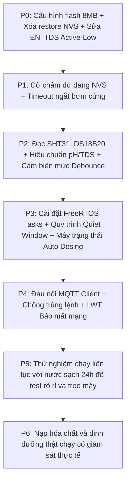

# CHECKLIST LẬP TRÌNH & HƯỚNG DẪN KIỂM THỬ FIRMWARE ESP32-S3
## Dự án: Hệ Thống Thủy Canh NFT AIoT

> Tài liệu này được biên soạn để chuyển dịch từ các kịch bản lý thuyết (`KICH_BAN_HOAN_CHINH.md`) thành một danh sách công việc (checklist) lập trình cụ thể từng bước, phân chia theo các file trong thư mục `firmware/` và đi kèm hướng dẫn kiểm tra, kiểm thử thực tế.

---

## 🛠️ PHẦN CHUẨN BỊ: ĐỊNH NGHĨA LẠI TÊN THIẾT BỊ THEO NGHIỆP VỤ

Để tránh nhầm lẫn giữa code cũ (`BOMLL1`, `IN_RL1`...) và kịch bản mới, trước khi bắt đầu hãy sửa file `config.h` để đổi tên chân theo đúng nghiệp vụ thực tế:

| Tên GPIO cũ | Tên GPIO mới | Chức năng vật lý | Trạng thái an toàn |
|---|---|---|---|
| `IN_RL1` | `PIN_PUMP_NFT_220V` (GPIO7) | Bơm tuần hoàn NFT | OFF (Mặc định) |
| `IN_RL2` | `PIN_AERATOR_220V` (GPIO6) | Máy sục khí oxy bể chứa | OFF (Mặc định) |
| `DEN1` | `PIN_LED_TANG1` (GPIO17) | Đèn LED tầng 1 | OFF (Mặc định) |
| `DEN2` | `PIN_LED_TANG2` (GPIO18) | Đèn LED tầng 2 | OFF (Mặc định) |
| `QUAT1` | `PIN_FAN_TANG1` (GPIO11) | Quạt thông gió tầng 1 | OFF (Mặc định) |
| `QUAT2` | `PIN_FAN_TANG2` (GPIO10) | Quạt thông gió tầng 2 | OFF (Mặc định) |
| `BOMLL1` | `PIN_PUMP_DOSE_A` (GPIO13) | Bơm châm dinh dưỡng chai A | OFF (Mặc định) |
| `BOMLL2` | `PIN_PUMP_DOSE_B` (GPIO12) | Bơm châm dinh dưỡng chai B | OFF (Mặc định) |
| `BOMLL3` | `PIN_PUMP_PH_DOWN` (GPIO8) | Bơm châm hóa chất giảm pH | OFF (Mặc định) |
| `BOM12V` | `PIN_PUMP_REFILL_12V` (GPIO9) | Bơm nước sạch bù bể chứa | OFF (Mặc định) |

---

## 📋 DANH SÁCH CÔNG VIỆC CẦN LẬP TRÌNH & PHƯƠNG PHÁP KIỂM THỬ

---

### Giai Đoạn P0: Sửa Lỗi Cấu Hình & An Toàn Phần Cứng

#### 1. Cấu hình phân vùng flash 8MB đúng bo thật
*   **File cần sửa:** `firmware/platformio.ini`
*   **Nội dung code:**
    *   Xóa dòng cấu hình 16MB cũ (`board_build.partitions = default_16MB.csv`, `board_upload.flash_size = 16MB`, v.v.).
    *   Đổi thành:
        ```ini
        board_build.partitions = default_8MB.csv
        board_upload.flash_size = 8MB
        ```
*   **Cách kiểm thử:**
    1. Tiến hành biên dịch (Build) và nạp (Upload) code xuống bo ESP32 thật qua PlatformIO.
    2. Quan sát log nạp xem ESP32 có nhận diện đúng chip 8MB Flash hay không.
    3. Thử chạy tính năng OTA cập nhật bản firmware nhỏ khác để kiểm tra tính ổn định của phân vùng mới.

#### 2. Sửa logic tắt tải khi khởi động (Không khôi phục trạng thái cũ từ Flash)
*   **File cần sửa:** `firmware/src/actuator.cpp`
*   **Nội dung code:**
    *   Trong hàm `hardware_init()`, loại bỏ hoàn toàn việc gọi `load_actuator_state` đối với các thiết bị đóng cắt như Relay và Bơm (chỉ phục hồi các thông số cấu hình hoặc thông tin hiệu chuẩn).
    *   Ép cứng toàn bộ các chân tải về giá trị `LOW` (tắt) khi khởi động.
*   **Cách kiểm thử:**
    1. Kết nối LED hoặc đồng hồ đo vào các chân Relay và bơm định lượng.
    2. Cắm điện/Reset ESP32 liên tục khoảng 10 lần.
    3. Kiểm tra xem có lần nào LED/bơm tự động bật sáng/chạy tích tắc lúc khởi động hay không. Yêu cầu: Tất cả phải tắt hoàn toàn.

#### 3. Cập nhật logic active-low cho chân nguồn TDS (`PIN_EN_TDS`)
*   **File cần sửa:** `firmware/src/actuator.cpp` và `firmware/include/config.h`
*   **Nội dung code:**
    *   Định nghĩa rõ trạng thái của `PIN_EN_TDS` (GPIO 42): `TDS_POWER_ON = LOW`, `TDS_POWER_OFF = HIGH`.
    *   Trong hàm `hardware_init()`, khởi tạo chân này ở mức `HIGH` (TDS_POWER_OFF) để ngắt nguồn TDS ngay khi boot.
*   **Cách kiểm thử:**
    1. Dùng đồng hồ đo điện áp VOM đo chân GPIO 42 ngay lúc cắm nguồn ESP32.
    2. Kết quả phải là ~3.3V (HIGH - Tắt TDS).
    3. Lập trình thử một hàm bật đo TDS trong 5 giây, kiểm tra xem điện áp chân GPIO 42 có kéo xuống 0V (LOW - Bật TDS) hay không.

---

### Giai Đoạn P1: Lớp Actuator An Toàn (Safe Actuator Layer)

#### 1. Viết cờ ghi nhớ giao dịch châm (`dose_in_progress`) vào NVS
*   **File cần sửa/tạo mới:** `firmware/src/actuator.cpp` (hoặc tạo file quản lý bộ nhớ riêng)
*   **Nội dung code:**
    *   Viết hàm `set_dosing_flag(bool in_progress)` để ghi trạng thái châm dinh dưỡng vào NVS.
    *   Trong `main.cpp`, kiểm tra cờ này trong hàm `setup()`. Nếu đọc lên thấy cờ đang `true` (nghĩa là lần chạy trước bị mất điện giữa chừng khi đang châm) -> Ghi nhận lỗi `DOSE_INTERRUPTED` và lập tức reset cờ về `false`.
*   **Cách kiểm thử:**
    1. Bật tính năng châm tự động hoặc thủ công.
    2. Ngay khi bơm đang châm, rút đột ngột nguồn của ESP32.
    3. Cắm nguồn lại, theo dõi log Serial. Log phải xuất dòng chữ cảnh báo lỗi `[FAULT] DOSE_INTERRUPTED - He thong mat dien khi dang cham!` và dừng toàn bộ bơm hóa chất.

#### 2. Lập trình giới hạn thời gian hoạt động cứng của bơm định lượng (Safety Timeout)
*   **File cần sửa:** `firmware/src/actuator.cpp`
*   **Nội dung code:**
    *   Trong hàm `actuator_set_state()` của các bơm định lượng (`PIN_PUMP_DOSE_A`, `B`, `pH Down`), khi nhận lệnh bật bơm, thiết lập một biến thời gian ngắt an toàn `pump_cutoff_time = millis() + timeout_limit`.
    *   Trong `loop()`, liên tục quét kiểm tra: nếu thời gian hiện tại vượt qua `pump_cutoff_time` mà bơm chưa tắt -> Cưỡng bức ghi chân GPIO về OFF để ngắt bơm và kích hoạt lỗi `DOSE_TIMEOUT`.
*   **Cách kiểm thử:**
    1. Gửi lệnh châm thủ công bơm A chạy trong 60 giây.
    2. Đặt giới hạn timeout cứng trong code cho bơm A là 10 giây.
    3. Theo dõi thực tế: Đúng 10 giây bơm A phải tự động tắt, Serial xuất lỗi `DOSE_TIMEOUT` và còi kêu báo động.

---

### Giai Đoạn P2: Tích Hợp Cảm Biến Thật & Bộ Đệm Bộ Lọc

#### 1. Tích hợp cảm biến nhiệt độ & độ ẩm không khí SHT30/SHT31 qua I2C
*   **File cần sửa:** `firmware/src/sensors.cpp`
*   **Nội dung code:**
    *   Khai báo và khởi tạo thư viện `Adafruit_SHT31` trên bus I2C (SDA GPIO5, SCL GPIO4).
    *   Thay thế các con số ảo `30.9` và `68%` bằng hàm đọc thực tế `sht31.readTemperature()` và `sht31.readHumidity()`.
*   **Cách kiểm thử:**
    1. Chạy hệ thống và mở cổng Serial.
    2. Hà hơi ấm hoặc dùng máy sấy tóc thổi nhẹ vào cảm biến SHT31.
    3. Quan sát chỉ số nhiệt độ/độ ẩm thay đổi tăng giảm tức thì trên màn hình monitor.

#### 2. Tích hợp cảm biến nhiệt độ nước DS18B20 qua giao tiếp OneWire
*   **File cần sửa:** `firmware/src/sensors.cpp`
*   **Nội dung code:**
    *   Sử dụng thư viện `OneWire` và `DallasTemperature` trên chân GPIO 14.
    *   Viết hàm đọc nhiệt độ nước thực tế. Nếu cảm biến không phản hồi (trả về giá trị `-127` độ C) -> Đánh dấu mẫu đo là `ERROR` và ngắt quyền châm tự động.
*   **Cách kiểm thử:**
    1. Theo dõi số đo nhiệt độ nước. Nhúng cảm biến DS18B20 vào cốc nước ấm/nước đá để xem sự thay đổi.
    2. Rút dây tín hiệu của DS18B20 ra khỏi mạch khi hệ thống đang chạy.
    3. Kiểm tra xem hệ thống có báo lỗi cảm biến và khóa tính năng tự động châm EC/pH lại hay không.

#### 3. Đọc và hiệu chuẩn cảm biến pH & TDS qua ADC (bù nhiệt độ nước)
*   **File cần sửa:** `firmware/src/sensors.cpp`
*   **Nội dung code:**
    *   Lập trình đọc điện áp analog từ các chân `PIN_ADC_PH` (GPIO 2) và `PIN_ADC_TDS` (GPIO 1).
    *   Tích hợp công thức bù nhiệt độ nước (đọc từ DS18B20) vào thuật toán tính toán độ dẫn điện (EC) để có giá trị quy đổi EC25 chuẩn ở 25 độ C.
*   **Cách kiểm thử:**
    1. Nhúng cảm biến vào dung dịch chuẩn (ví dụ pH 4.01/7.00, EC 1.4 mS/cm).
    2. Đọc giá trị trên Serial xem có đúng với thực tế không.
    3. Thay đổi nhiệt độ nước (nhúng cùng cảm biến DS18B20 vào nước lạnh hơn) xem giá trị EC25 quy đổi có giữ nguyên sự ổn định không (sai lệch không quá 2%).

#### 4. Đo lưu lượng dòng chảy bằng Flow Sensor (GPIO 41)
*   **File cần sửa:** `firmware/src/sensors.cpp`
*   **Nội dung code:**
    *   Sử dụng ngắt ngoài (`attachInterrupt`) hoặc bộ đếm xung phần cứng `PCNT` trên chân GPIO 41 để đếm số lượng xung phát ra từ cảm biến dòng chảy.
    *   Tính toán lưu lượng thực tế theo công thức: `Lưu lượng (L/phút) = Số xung đếm được trong 1 giây / Hệ số cảm biến`.
*   **Cách kiểm thử:**
    1. Dùng miệng thổi nhẹ vào cánh quạt của cảm biến dòng chảy hoặc cho nước chảy qua.
    2. Kiểm tra xem chỉ số lưu lượng hiển thị trên Serial có thay đổi từ 0.0 lên các số dương hay không.

#### 5. Thuật toán lọc Debounce 2 giây cho cảm biến mức nước (phao cơ)
*   **File cần sửa:** `firmware/src/sensors.cpp`
*   **Nội dung code:**
    *   Đọc trạng thái các chân `PIN_LEVEL1` đến `PIN_LEVEL4`.
    *   Trạng thái cạn/đầy của bể chứa hoặc chai hóa chất chỉ được thay đổi khi và chỉ khi giá trị đọc được giữ ổn định liên tục trong vòng 2000 ms (2 giây).
*   **Cách kiểm thử:**
    1. Dùng tay nhấc phao cơ lên và hạ xuống thật nhanh (nhấp nhả liên tục dưới 1 giây).
    2. Hệ thống phải bỏ qua và không đổi trạng thái của phao.
    3. Giữ phao ở vị trí cạn liên tục trong 3 giây. Hệ thống phải đổi trạng thái sang "Cạn" ngay lập tức.

---

### Giai Đoạn P3: Khối Điều Khiển FreeRTOS & Máy Trạng Thái

Đây là cốt lõi của kịch bản, cần triển khai cấu trúc đa nhiệm để hệ thống chạy ổn định.

#### 1. Phân chia 3 Tasks FreeRTOS & Cơ chế hàng đợi Queue
*   **File cần sửa:** Tạo file mới `firmware/src/control.cpp` và `firmware/include/control.h` (hoặc viết vào `main.cpp`)
*   **Nội dung code:**
    *   Khai báo 3 task:
        1.  `TaskNetwork`: chạy trên Lõi 0 (xử lý WiFi, WebSocket, MQTT).
        2.  `TaskSensors`: chạy trên Lõi 1 (định kỳ đọc cảm biến, thực hiện đo hóa học).
        3.  `TaskSafetyControl`: chạy trên Lõi 1 (chứa máy trạng thái điều khiển tải, kiểm tra an toàn interlock).
    *   Tạo `QueueHandle_t sensorQueue` và `QueueHandle_t commandQueue` để truyền dữ liệu an toàn.
*   **Cách kiểm thử:**
    1. In ra log Serial kèm thông tin Lõi đang chạy (`xPortGetCoreID()`).
    2. Kiểm tra xem các tác vụ có chạy đúng lõi đã phân chia hay không.
    3. Thử tạo một vòng lặp vô hạn nhân tạo (ví dụ `while(1);`) trong `TaskNetwork` (mất mạng).
    4. Kiểm tra xem `TaskSafetyControl` và `TaskSensors` có tiếp tục chạy bình thường hay không (nếu có, tức là đa nhiệm hoạt động tốt).

#### 2. Lập trình chu kỳ đo Quiet Window (Cửa sổ đo yên tĩnh)
*   **File cần sửa:** `firmware/src/control.cpp`
*   **Nội dung code:**
    *   Thực hiện đúng trình tự tắt nhiễu: Tắt quạt, đèn, bơm tuần hoàn, máy sục khí, tắt nguồn TDS.
    *   Đợi đúng 60 giây (dùng biến so sánh thời gian, tuyệt đối không dùng hàm `delay()`).
    *   Đọc DS18B20.
    *   Đọc pH: Thu thập 30 mẫu liên tiếp, sắp xếp tăng dần, bỏ 6 mẫu nhỏ nhất (20%) và 6 mẫu lớn nhất (20%), lấy trung bình 18 mẫu còn lại. Lặp lại thêm một cụm 30 mẫu thứ hai. Nếu trung bình của hai cụm lệch không quá 0.15 pH -> Nhận kết quả.
    *   Bật nguồn TDS (`PIN_EN_TDS` ghi LOW) -> Chờ đúng 2 giây -> Đo TDS giống như cách đo pH (2 cụm, loại biên 20%). Nếu lệch không quá 5% -> Nhận kết quả. Tắt ngay nguồn TDS (`PIN_EN_TDS` ghi HIGH).
    *   Bật lại các tải về trạng thái trước đó. Toàn bộ quy trình phải dừng hoặc hoàn tất trước 120 giây.
*   **Cách kiểm thử:**
    1. Kích hoạt quy trình đo hóa học.
    2. Bơm tuần hoàn và sục khí phải tắt ngay lập tức.
    3. Theo dõi thời gian: Đúng 60 giây sau hệ thống mới bắt đầu đọc giá trị pH.
    4. Đúng 120 giây sau (hoặc sớm hơn khi đo xong), bơm tuần hoàn và sục khí phải tự động bật lại.

#### 3. Lập trình máy trạng thái điều khiển châm dinh dưỡng (A/B Dosing)
*   **File cần sửa:** `firmware/src/control.cpp`
*   **Nội dung code:**
    *   Triển khai máy trạng thái qua lệnh `switch(system_state)` với các trạng thái `SAFE_BOOT`, `NORMAL`, `QUIET_MEASURE`, `DOSE_AB`, `DOSE_PH`, `REFILL`, `FAULT`.
    *   Khi châm dinh dưỡng: Bật bơm A -> Tắt bơm A -> Chờ trộn tối thiểu 60 giây -> Bật bơm B -> Tắt bơm B -> Chờ trộn 5 phút -> Kích hoạt Quiet Window đo lại EC.
    *   Giới hạn tối đa 2 vòng châm cho một chu kỳ đo.
*   **Cách kiểm thử:**
    1. Giả lập giá trị EC nước cực thấp (< 300 ppm) để kích hoạt tự động châm.
    2. Quan sát thứ tự bật tắt: Bơm A chạy -> Tắt -> Bơm tuần hoàn chạy trộn -> Bơm B chạy -> Tắt -> Trộn -> Tắt bơm tuần hoàn để chạy Quiet Window đo lại.
    3. Đảm bảo bơm A và bơm B không bao giờ sáng đèn/bật cùng một thời điểm.

#### 4. Lập trình tự động cấp nước sạch (Refill)
*   **File cần sửa:** `firmware/src/control.cpp`
*   **Nội dung code:**
    *   Khi phao báo nước bể cạn (`PIN_LEVEL1` báo cạn liên tục 2 giây): Chuyển trạng thái sang `REFILL`.
    *   Tắt bơm tuần hoàn, khóa châm hóa chất, giữ máy sục khí ON.
    *   Bật bơm cấp nước sạch (`PIN_PUMP_REFILL_12V`).
    *   Bơm sẽ tắt khi phao báo đầy trở lại HOẶC khi chạy quá thời gian cấu hình tối đa `fill_max_time` (ví dụ 10 phút) -> Ghi nhận lỗi `REFILL_TIMEOUT` và dừng hệ thống để kiểm tra rò rỉ.
*   **Cách kiểm thử:**
    1. Nhấc phao cơ bể chứa giả lập cạn nước. Bơm bù nước sạch phải bật lên sau 2 giây. Bơm tuần hoàn phải tắt.
    2. Giữ phao cạn liên tục. Đặt giả lập `fill_max_time` là 15 giây.
    3. Kiểm tra xem sau 15 giây bơm nước sạch có tự tắt và còi báo lỗi `REFILL_TIMEOUT` có kêu không.

---

### Giai Đoạn P4: Giao Tiếp MQTT Với Raspberry Pi 4

#### 1. Thiết lập MQTT Client Pub/Sub đúng chủ đề (Topic)
*   **File cần tạo mới:** `firmware/src/mqtt_handler.cpp` và `firmware/include/mqtt_handler.h`
*   **Nội dung code:**
    *   Sử dụng thư viện MQTT (như `PubSubClient`).
    *   Gửi bản tin cảm biến định kỳ lên chủ đề `hydro/{device_id}/v1/telemetry`.
    *   Nhận lệnh điều khiển thủ công từ chủ đề `hydro/{device_id}/v1/command/set` và gửi phản hồi trạng thái nhận lệnh (ACK) lên `hydro/{device_id}/v1/command/ack`.
    *   Đăng ký thông điệp di chúc `availability` mức QoS 1, có Retain với giá trị `offline` khi mất kết nối.
*   **Cách kiểm thử:**
    1. Mở phần mềm MQTT Explorer trên máy tính, kết nối chung vào Broker MQTT của Pi 4.
    2. Theo dõi gói tin JSON được gửi lên từ ESP32 định kỳ xem có đúng định dạng quy định không.
    3. Rút dây nguồn ESP32, kiểm tra xem trạng thái chủ đề `availability` có tự động chuyển thành `offline` sau vài giây hay không.

#### 2. Lập trình chống lệnh trùng lặp và kiểm tra thời hạn lệnh (TTL)
*   **File cần sửa:** `firmware/src/mqtt_handler.cpp`
*   **Nội dung code:**
    *   Lưu trữ ID của lệnh gần nhất (`last_command_id`). Nếu nhận lệnh mới có ID trùng với ID cũ -> Bỏ qua lệnh này (tránh thực hiện 2 lần khi mạng QoS 1 truyền lại).
    *   Kiểm tra thời gian tạo lệnh `issued_ts_ms` và thời gian sống `ttl_ms`. Nếu thời gian hiện tại vượt quá thời hạn -> Hủy lệnh và gửi ACK thông báo lệnh hết hạn (`expired`).
*   **Cách kiểm thử:**
    1. Dùng MQTT Explorer gửi 2 lệnh liên tiếp có chung một `command_id` để bật bơm A. ESP32 chỉ được thực hiện châm đúng 1 lần.
    2. Gửi một lệnh có thời gian tạo của ngày hôm qua (hoặc cài đặt `ttl_ms` bằng 500ms nhưng gửi chậm hơn 1 giây). ESP32 phải từ chối và phản hồi lại ACK là `expired`.

---

## 🗺️ TÓM TẮT LỘ TRÌNH TRIỂN KHAI VÀ KHUYÊN DÙNG CHO HỆ THỐNG CỦA BẠN



### 💡 Lưu ý quan trọng nhất khi code:
*   **Không dùng hàm `delay()`:** Trong các tác vụ đa nhiệm FreeRTOS, việc dùng hàm `delay()` sẽ làm treo luồng điều khiển và gây kích hoạt Watchdog. Hãy sử dụng hàm `vTaskDelay()` hoặc so sánh mốc thời gian bằng cách lấy hiệu `millis() - last_time >= interval`.
*   **Sử dụng Serial Debug hiệu quả:** Tại mỗi bước đổi trạng thái của bơm hoặc cảm biến, hãy in ra log chi tiết qua Serial kèm theo mốc thời gian (`millis()`) để dễ dàng theo dõi trình tự hoạt động khi chạy kịch bản.
